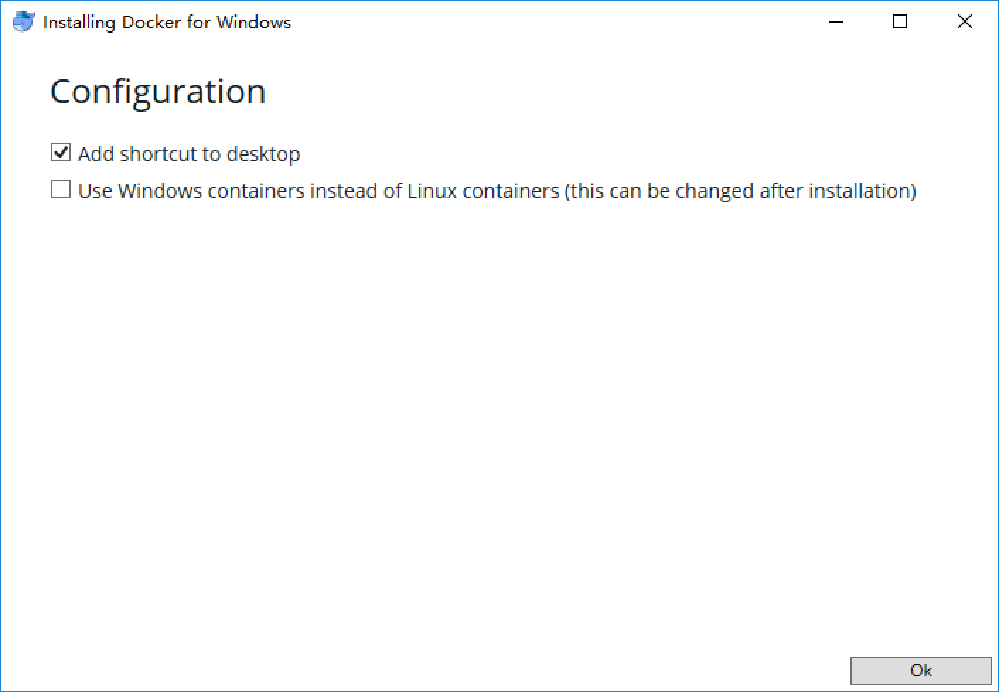
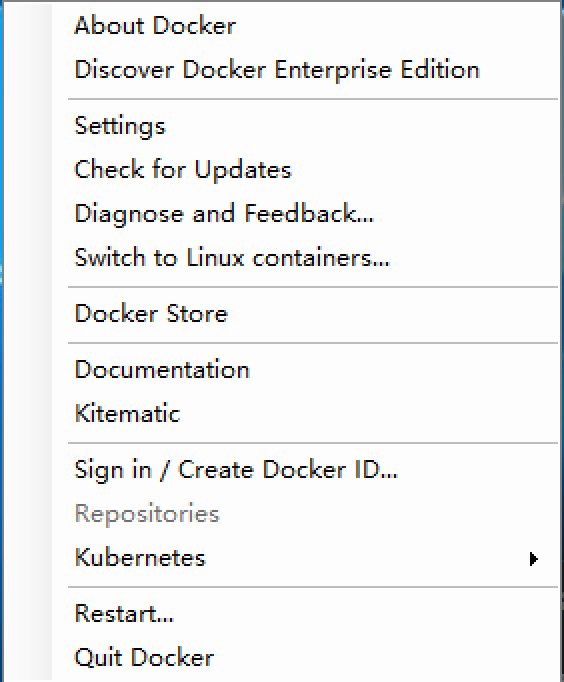

# Docker基础

**Docker使用指南**

### I. 安装：

---

课程文件提供已经下载好的适合Mac和Windows的安装包。

也可以自行登录[docker官网](https://www.docker.com/get-docker)注册账号，下载Community Edition版本的docker安装程序进行安装。


### II. 使用方法：

---

_**MacOS**_

拷贝Bioinfo_docker.tar到本地目录，如~/Desktop，运行docker程序，然后在终端进行操作，基本命令如下：

```
cd ~/Desktop
docker load -i Bioinfo_docker.tar                   # 加载镜像

docker images                                       # 查询镜像

docker run --name test -it Bioinfo_docker:latest    # 运行容器进行后续操作

docker ps -a                                        # 查询容器信息（包括container_id)

docker commit -a author_name -m other_message container_id my_docker      # 从容器建立镜像

docker save -o my_docker.tar my_docker              # 保存镜像

docker kill $container_id                           # 终止容器

docker rm $(docker ps -q -a)                        # 删除所有容器

docker rmi $(docker images -q)	                    # 删除所有镜像（不会删除保存的tar文件）

```


_**Windows**_

只有64位的Windows系统才能安装docker，以下操作在64位Win10系统执行。安装的时候选项如图。


如果安装时选择了Windows容器版本，则需要在运行了docker之后，从选项卡选择切换到Linux容器版本。


安装好docker后，按照提示开启hyper-v功能。运行docker，打开powershell，操作命令同MacOS版本。


### III. 更多阅读：

---

更多命令详见[docker命令大全](http://www.runoob.com/docker/docker-command-manual.html)