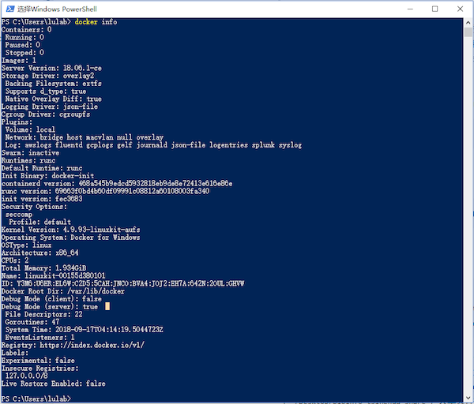
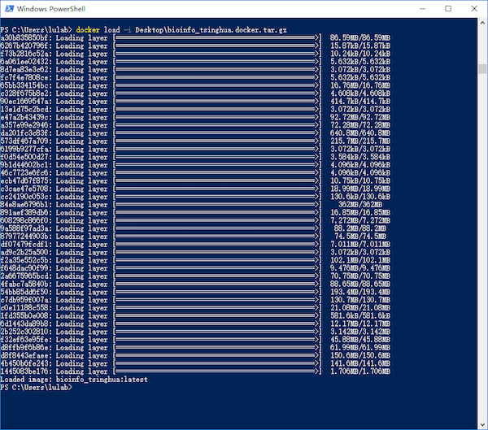

# Appendix III. Docker

## 1\) MAC 用户使用 Docker 指南

MAC 用户在安装和使用Docker 参见[Getting Started 5\)](../getting-started.md#use-docker)，如果遇到使用问题，可以参考官网的 [这篇文章](https://docs.docker.com/docker-for-mac/)，启动并设置Docker Desktop。

下面我们讲解 Windows 用户应该如何使用 Docker

## 2) windows 10 非 pro 用户使用 Docker 指南——通过Virtual Box 运行docker {#win-vb-use-docker}

此部分教程将介绍如何在windows 10 非pro机器上使用virtual box，安装并配置好virtual box后即可在其内部运行docker。

### 2a) 安装 Virtual Box

至 [官网](https://www.virtualbox.org/wiki/Downloads) 下载安装程序，运行，按照提示完成安装。

### 2b) 下载虚拟机

下载我们提供的 Ubuntu 虚拟机：[bioinfo\_tsinghua.virtualbox.ova](https://cloud.tsinghua.edu.cn/f/c91ec26fc5774303a5df/) （用户名和密码均为 `test`）。

### 2c) 导入虚拟机

`管理` -> `导入虚拟电脑`   


选中上一步下载完成的 `bioinfo_tsinghua.virtualbox.ova`   

   

> **注意：** 路径名不能有空格、中文等，可以直接放在某一磁盘下，比如这里我们放在了 D 盘。  


导入时一般使用默认选项即可。如果 C 盘空间不足，可以修改以下最后一个选项——`虚拟硬盘`，需要手动输入路径，与上文一样，不能有空格、中文等。  


### 2d) 启动虚拟机

导入完成后，启动 `bioinfo_tinghua`, 等待2至5分钟，虚拟机即可使用。


### 2e) 打开 Terminal


顺利完成以上步骤后，请到 [Getting Started 5d\)](../getting-started.md#load-image) 完成后续操作。

## 3) windows 10 pro 64 使用 Docker 指南 {#win-pro-use-docker}

### 3a) 安装 Docker

从 [官网](https://store.docker.com/editions/community/docker-ce-desktop-windows) 下载 Docker，并进行安装。

### 3b) 启用Hyper-V

安装完成后，选择`Enable & Restart`以启用Hyper-V


### 3c) 启动 Power shell 

在开始菜单搜索 PowerShall, 并启动。


### 3d) 检查安装

输入以下命令，检查 Docker 是否成功安装。



### 3e) 导入 Docker 镜像

将 Docker image: [bioinfo\_tsinghua.docker.tar.gz](https://cloud.tsinghua.edu.cn/f/b8dcdfa425ba4880b4f3/)下载到桌面，并且通过在 Power shell 中输入以下命令导入将镜像导入到 Docker 中。

```bash
docker load -i Desktop\bioinfo_tsinghua.docker.tar.gz
```



### 3f) 首次创建容器


首先，在桌面新建 `bioinfo_tsinghua_share` 文件夹用于共享文件

```bash
mkdir ~/Desktop/bioinfo_tsinghua_share
```

```bash
docker run --name=bioinfo_tsinghua -dt --restart unless-stopped -v ~/Desktop/bioinfo_tsinghua_share:/home/test/share bioinfo_tsinghua
```

然后，新建一个名为 `bioinfo_tsinghua` 的容器（除非有特殊说明，接下来的章节中所有操作均在该容器中进行）。

> 参数说明：
>
> * 设置该容器能一直在后台保持运行状态（`-dt --restart unless-stopped`）
> * 主机 (Windows）和docker容器（例如Linux）设置了一个文件夹同步，可以互传文件：
>   * Windows: `~/Desktop/bioinfo_tsinghua_share` == LINUX: `/home/test/share`

在 Windows 10 Pro 上，我们在 Docker 中创建的 `/home/test/share` 归 root 所有，所以要将其改为归 test 用户所有。

```bash
docker exec -u root bioinfo_tsinghua chown test:test /home/test/share 
```

执行这一步时，系统会弹出以下提示，我们选择 `Share it`

 选择

### 3g)使用容器

如果容器创建成功，之后每次只需要启动Docker程序，然后在 Power shell 中输入以下命令即可进入容器：

```bash
docker exec -it bioinfo_tsinghua bash
```

之后即可运行本教程中提供的 Linux 命令来执行任务，比如 1.Linux 这一章的 `ls`

任务完成后，输入 `exit` 即可回到 Power shell。


完成以上操作后，请回到 [Getting Started 5g\)](../getting-started.md#recover-container) 继续阅读。

## 4) docker 常用命令

```bash
docker ps #查看当前正在运行的容器
docker ps -a #查看所有容器
docker images #查看所有镜像
```

感兴趣的读者可自行学习相关教程，参见6) 参考阅读部分。

## 5) 清理环境

可以使用如下命令清理不再需要的文件：

```bash
rm ~/Desktop/bioinfo_tsinghua.docker.tar.gz # 删除下载的文件
```

如果需要删除镜像，可以使用以下命令，请**慎重**使用该命令。

```text
docker rmi bioinfo_tsinghua # 删除镜像
```

## 6) 参考阅读

> 这里推荐阅读两篇Docker安装教程，分别是[《macOS 安装 Docker》](https://yeasy.gitbooks.io/docker_practice/install/mac.html)和[《Windows 10 PC 安装 Docker CE》](https://yeasy.gitbooks.io/docker_practice/install/windows.html)，来自于[《Docker——从入门到实践》](https://legacy.gitbook.com/book/yeasy/docker_practice/details)书，这本书对Docker进行了深入浅出的讲解，对于初学者理解和学习docker技术有所帮助。另外，网上也有很多docker教程，有深入学习兴趣的同学可以自行检索学习。

