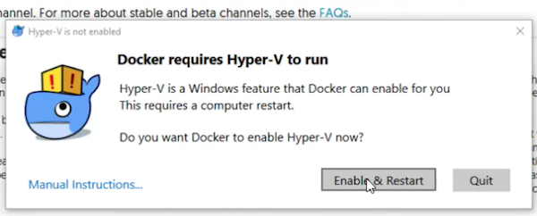
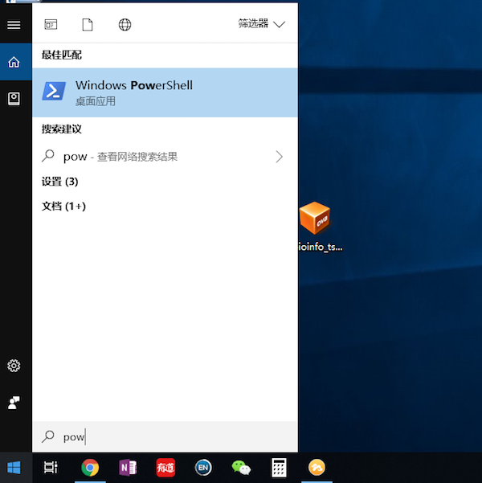

# Appendix III. Docker

## 1\) MAC 用户使用 Docker 指南

MAC 用户在安装和使用Docker 参见[Getting Started 5\)](https://lulab.gitbooks.io/teaching/getting-started.html)，如果遇到使用问题，可以参考官网的 [这篇文章](https://docs.docker.com/docker-for-mac/)，启动并设置Docker Desktop。

## 2\) Windows 用户使用 Docker 指南

### 2a\) windows 10 非 pro 用户 通过Virtual Box 运行docker <a id="win-vb-use-docker"></a>

此部分教程将介绍如何在windows 10 非pro机器上使用virtual box，安装并配置好virtual box后即可在内部运行docker。

#### 2a.1\) 安装 Virtual Box

至 [官网](https://www.virtualbox.org/wiki/Downloads) 或 [清华云](https://cloud.tsinghua.edu.cn/f/89c75b51b5bd423aa92b/) 下载安装程序，运行，按照提示完成安装。

#### 2a.2\) 下载我们提供的 Ubuntu 虚拟机

[bioinfo\_tsinghua.virtualbox.ova](https://cloud.tsinghua.edu.cn/f/c91ec26fc5774303a5df/) （用户名和密码均为 `test`）。

#### 2a.3\) 导入虚拟机

`管理` -&gt; `导入虚拟电脑` 

选中上一步下载完成的 `bioinfo_tsinghua.virtualbox.ova`    
 **注意：** 路径名不能有空格、中文等，可以直接放在某一磁盘下，比如这里我们放在了 D 盘。 

导入时一般使用默认选项即可。如果 C 盘空间不足，可以修改以下最后一个选项——`虚拟硬盘`，需要手动输入路径，与上文一样，不能有空格、中文等。 

#### 2a.4\) 导入完成后，启动 `bioinfo_tinghua`, 等待2至5分钟，虚拟机即可使用。


#### 2a.5\) 打开 Terminal


顺利完成以上步骤后，请到 [Getting Started 5d\)](../getting-started.md#load-image) 完成后续操作。

### 2b\) windows 10 pro 64 安装和使用方法 <a id="win-pro-use-docker"></a>

#### 2b.1\) 安装 Docker

从 [官网](https://store.docker.com/editions/community/docker-ce-desktop-windows) 或者 [清华云盘](https://cloud.tsinghua.edu.cn/f/a28251b47d0e471a8d8f/) 下载Docker，并进行安装。

**打开 Hyper-V**

选择`Enable & Restart`以打开Hyper-V



#### 2b.2\) 启动PowerShell

在开始菜单搜索 PowerShall, 并启动。



#### 2b.3\) 在PowerShell中输入命令导入docker镜像

将Docker image: [bioinfo\_tsinghua.docker.tar.gz](https://cloud.tsinghua.edu.cn/f/b8dcdfa425ba4880b4f3/)下载到桌面，并且通过在PowerShell中输入以下命令导入将镜像导入到 Docker 中。

```bash
docker info
docker load -i Desktop\bioinfo_tsinghua.docker.tar.gz
```

 

#### 2b.4\) 首次创建容器

```bash
mkdir ~/Desktop/bioinfo_tsinghua_share

docker run --name=bioinfo_tsinghua -dt --restart unless-stopped -v ~/Desktop/bioinfo_tsinghua_share:/home/test/share bioinfo_tsinghua

docker exec -u root bioinfo_tsinghua chown test:test /home/test/share  # Windows 10 pro set dir use root as default user, we need to set it be owned by test
```

  选择`Share it`

#### 2b.5\)使用容器

如果容器创建成功，之后每次只需要启动Docker程序，然后在Powershell中输入以下命令即可进入容器：

```bash
docker exec -it bioinfo_tsinghua bash
```


完成以上操作后，请回到 [Getting Started 5g\)](../getting-started.md#recover-container) 继续阅读。

## 3\) docker 常用命令

```bash
docker ps #查看当前正在运行的容器
docker ps -a #查看所有容器
docker images #查看所有镜像
```

感兴趣的读者可自行学习相关教程，参见5\) 参考阅读部分。

## 4\) 清理环境

可以使用如下命令清理不再需要的文件：

```bash
docker rmi bioinfo_tsinghua # 删除镜像
rm ~/Desktop/bioinfo_tsinghua.docker.tar.gz # 删除下载的文件
```

如果需要删除容器，可以使用以下命令，请**慎重**使用该命令。

```text
docker rm -f bioinfo_tsinghua # 强行删除容器
```

## 5\) 参考阅读

> 这里推荐阅读两篇Docker安装教程，分别是[《macOS 安装 Docker》](https://yeasy.gitbooks.io/docker_practice/install/mac.html)和[《Windows 10 PC 安装 Docker CE》](https://yeasy.gitbooks.io/docker_practice/install/windows.html)，来自于[《Docker——从入门到实践》](https://legacy.gitbook.com/book/yeasy/docker_practice/details)书，这本书对Docker进行了深入浅出的讲解，对于初学者理解和学习docker技术有所帮助。另外，网上也有很多docker教程，有深入学习兴趣的同学可以自行检索学习。

