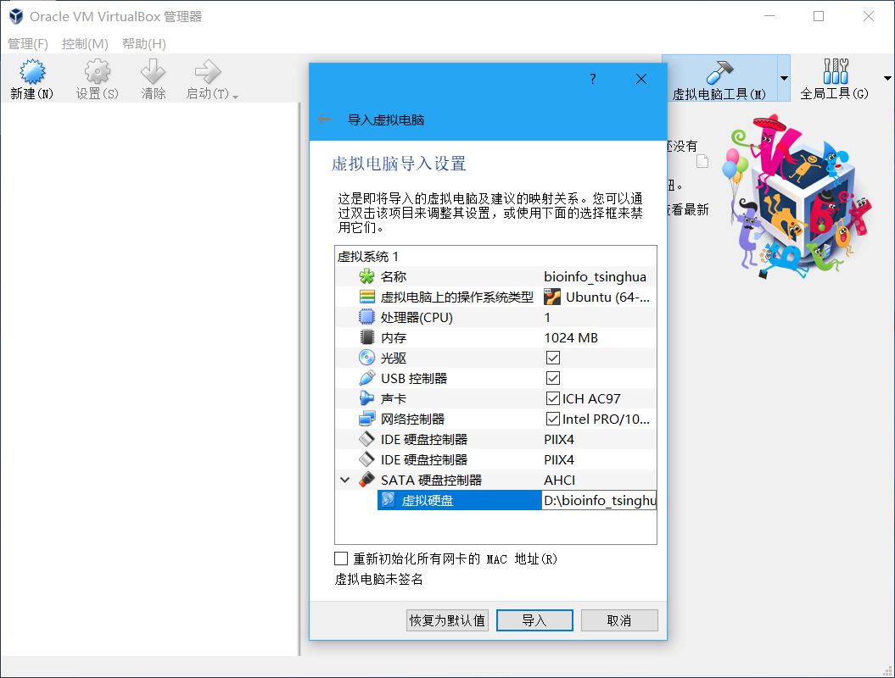
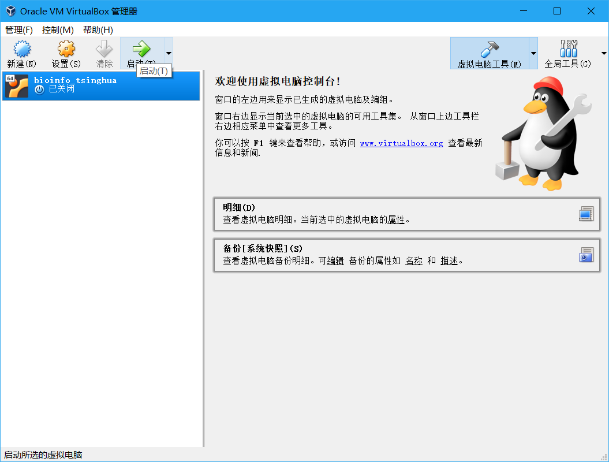

# Docker

## Pipeline 

<!--  -->

## Data Structure 


1**. 安装并运行docker程序：**







安装完成后，需要检查软件是否正常运行，docker官网有docker get started，例如MAC用户可以按照进入[get started](https://docs.docker.com/docker-for-mac/)地址，按照提示启动并设置Docker Desktop。


​


## Running Scripts（MacOS+**Terminal**\(终端\)程序进行操作）

### docker 

```bash
docker ps #查看当前正在运行的容器
docker ps -a #查看所有容器
docker images #查看所有镜像

docker start contianer_name_or_id # 启动容器
docker stop contianer_name_or_id  #停止容器
docker rm contianer_name_or_id # 删除容器
docker rmi image_name_or_id # 删除镜像
```


#### 4.exit

输入命令`exit`，则会一层一层退出，直到进入terminal用户界面。

例如

```
test@bioinfo_tsinghua:/$ exit
exit
qianqiandexiaopingguodeMacBook-Pro:
```


#### 7.delete/clean containers and images

删除镜像image前必须先删除使用此镜像的所有容器


## Tips/Utilitie


上图所示的命令是新建name=bioinfo容器，并将bioinfo容器中的Desktop下路径挂载到mac主机桌面上的bioinfo文件夹中。

因此，在mac的terminal终端输入docker 挂载宿主机目录命令前，必须确定两件事，第一件事是mac桌面上有bioinfo文件夹，没有则需要新创建；第二件事是已经load了ubuntu：latest 镜像。然后才能输入挂载主机目录的命令。

**推荐使用挂载主机目录的方法创建的容器去练习本教程接下来的章节，在所有章节running scripts前切换docker工作目录到Desktop，最后你会发现所有inputs&outputs的文件都会同步到mac桌面的bioinfo文件夹中，便于管理和查看结果。同时，从本地添加到bioinfo文件夹下面的文件或子文件夹，也可以在docker中`ls`查看。**

**so，同步的前提是，工作目录与挂载主机目录一致。也就是说，在所有章节running scripts前切换docker工作目录到Desktop，也就是输入`cd Desktop`命令，否则将无法同步，如下图所示。**


### 参考阅读

> 这里推荐阅读两篇Docker安装教程，分别是[《macOS 安装 Docker》](https://yeasy.gitbooks.io/docker_practice/install/mac.html)和[《Windows 10 PC 安装 Docker CE》](https://yeasy.gitbooks.io/docker_practice/install/windows.html)，来自于[《Docker——从入门到实践》](https://legacy.gitbook.com/book/yeasy/docker_practice/details)书，这本书对Docker进行了深入浅出的讲解，对于初学者理解和学习docker技术有所帮助。另外，网上也有很多docker教程，有深入学习兴趣的同学可以自行检索学习。

## Homework and more

根据教程指导，安装Docker，load本教程提供的ubuntu：latest镜像，完成Running Scripts部分的基础操作练习，然后尝试更多的镜像和容器管理操作，例如容器创建、查看、启动、终止、删除等。

