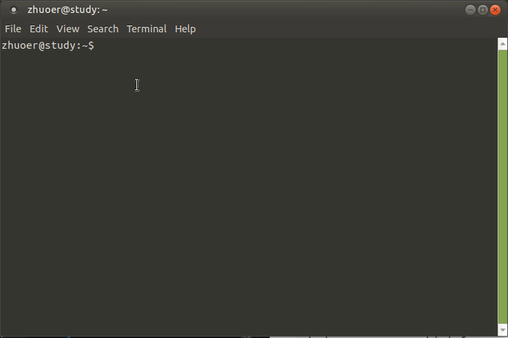

# Getting Started

## 1）预修课程准备

1. 基本生物课程：    如《遗传学》和/或《分子生物学》
2. 基本统计课程：    如《概率论》和/或《生物统计》
3. 基本数学课程：    如《线性代数》
4. 基本计算机课程：如《C语言》

## 2）Learning Materials

* Tutorial 
  * **Basic Tutorial** (this one) 
  * [**Advanced Tutorial**](https://lulab.gitbook.io/training)  

> see more learning materials in [Appendix I. Keep Learning](https://lulab.gitbooks.io/teaching/content/appendix/appendix1.more.html)

## 3）GitHub - Document your work 

* [GitHub](https://github.com/lulab/Shared) for students (shared code and scripts）
  * Write documents with [Markdown](https://github.com/adam-p/markdown-here/wiki/Markdown-Cheatsheet) Language

## 4) 使用说明

除非特殊说明，本章中的命令均是在自己电脑的 Terminal （终端）程序中进行。

每一章的操作都在一个独立的目录（位于用户家目录下）下进行，我们称其为**章节目录**。如 GSEA 这一章中提到 “以下操作均在 `gsea/` 目录下进行。”，指的就是在 `/home/test/gsea` 下进行该章所有操作。

每一步的结果都可以在章节目录的 `success/` 的相应文件夹中查看。（比如第一步没有在 `gsea/input/` 中生成要求的文件的话，可以直接从 `gsea/success/input` 中拷贝，然后继续下一步。）

## 5）Docker

We provide a Linux Docker, which is a modern solution of setting up a virtual Linux OS. (For advanced users, the Docker is based on Ubuntu 18.04, which means you need to use `apt` to install additional softwares.)

### 5a）安装 Docker

从 [Docker 官网](https://www.docker.com/get-docker)下载 Mac 版本的 Docker 程序，安装并运行。

> **注意：** Windows 系统不予介绍，因为 Docker 官网只支持 64 位的企业版 Windows。

运行以下命令，检查 Docker 是否正常安装

```
docker info
```

### 5b）载入镜像

首先将该教程配套的 Docker image，[lulab.tar.gz](https://cloud.tsinghua.edu.cn/f/9880ab2c56104b858173/)，下载到桌面。（高级用户也可以使用其它目录，但下文的 `~/Desktop` 也要作出相应修改）。

```bash
docker load < ~/Desktop/lulab.tar.gz
```

### 5c) 创建容器 {#create-container}

```bash
docker run --name=lulab -v ~/Desktop/share:/home/test/share -dt --restart unless-stopped lulab
```

这里我们新建了一个名为 `lulab` 的容器（除非有特殊说明，接下来的章节中所有操作均在该容器中进行），同时设置该容器能一直在后台保持运行状态（`-dt --restart`），并且该容器的 `/home/test/share` 与自己电脑的 `~/Desktop/share` 共享文件。

### 5d）使用容器 {#use-container}

每次运行书中的命令前，先进入到容器中的 bash：`docker exec -it lulab bash`。然后再执行相关操作, 如下图所示。



图1. 进入容器中的 bash（这里演示的是 Linux 的 Ternimal）

如果想要查看容器中的文件，可在容器中将其复制（`cp`）到 `/home/test/share`，然后打开自己电脑的 `~/Desktop/share` 文件夹。

### 5e）恢复容器

如果你不小心执行了错误操作，以至于无法正常执行本教程中的某个 pipeline，可以删除该容器，然后新建一个干净的容器，从头开始。

`docker rm -f lulab`

然后重复 [创建容器](#create-container) 命令


## 6）演示视频

### 6a) 如何在mac电脑使用docker

[@youtube](https://youtu.be/c1ldhV7dAhg)   
<iframe width="400" height="300" src="https://www.youtube.com/embed/c1ldhV7dAhg" frameborder="0" allow="autoplay; encrypted-media" allowfullscreen></iframe> 

[@bilibili](https://www.bilibili.com/video/av30426956/)   
<iframe width="400" height="300" src="https://player.bilibili.com/player.html?aid=30426956&cid=53094338&page=1" allowfullscreen></iframe>


### 6b) 如何使用 UCSC genome browser

[@youtube](https://youtu.be/eTgEtfI65hA)
  
<iframe width="400" height="300" src="https://www.youtube.com/embed/eTgEtfI65hA" frameborder="0" allow="autoplay; encrypted-media" allowfullscreen></iframe>

[@bilibili](https://www.bilibili.com/video/av30448417/)

<iframe width="400" height="300" src="https://player.bilibili.com/player.html?aid=30448417&cid=53132461&page=1" allowfullscreen></iframe>

**注意**：
* 对于处理好的测序数据（bigWig，BAM,bigBed)，UCSC仅支持通过提供URL链接或直接输入。
* 在比较不同样本的数据时，需要根据样本本身测序深度的不同来对纵坐标进行调整,从而保证该区域/位点测序数据能够显示完整并且可以相互比较。
* 有时，用bedtools genomecov scale之后的bigwig文件纵坐标仍然会出现显示不完整等现象，此时需要手动调整下。

### 6b) 如何使用 IGV genome browser

* 演示视频   
[@youtube](https://youtu.be/6_1ZcVw7ptU)

<iframe width="400" height="300" src="https://www.youtube.com/embed/6_1ZcVw7ptU" frameborder="0" allow="autoplay; encrypted-media" allowfullscreen></iframe>

* 演示视频      
[@bilibili](https://www.bilibili.com/video/av30448472/)

<iframe width="400" height="300" src="https://player.bilibili.com/player.html?aid=30448472&cid=53133093&page=1" allowfullscreen></iframe>


## 7) Homework

1. Register a GitHub account, create a repository. and write a README.md file online.
2. Install Docker on your own machine, dowload the docker image file, [Bioinfo_docker.tar](https://cloud.tsinghua.edu.cn/f/fef06408bbc446f6bb6e/?dl=1), from this tutorial, then run it. 


