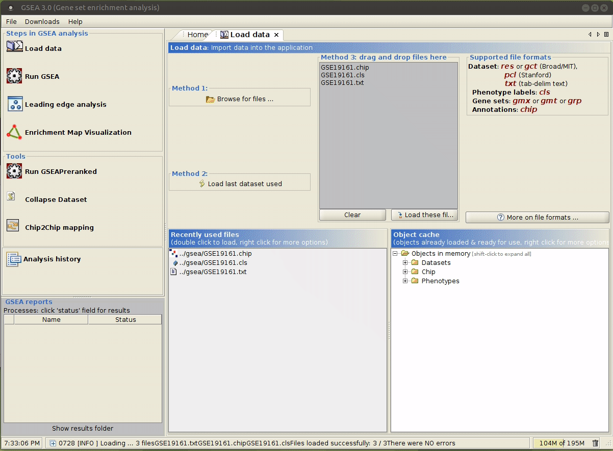

# 4.3. GSEA

## 1) Pipeline


## 2) data structure

### 2a) getting software & data {#install-gsea}

- 程序下载与安装（Docker 中均已安装好）：

  - 进入 [GSEA官方下载页面](http://software.broadinstitute.org/gsea/downloads.jsp)（需要登录方可进入，只需输入邮箱即可），在 `Software` tab下载 "javaGSEA Java Jar file"。已经安装。
  - 安装 [Java8](http://www.oracle.com/technetwork/java/javase/downloads/index.html) 。已经安装
  - qGSEA 已经安装。感兴趣请看 4) Tips/Utilities 安装 qGSEA。
   


- 准备数据：至 [GEO](https://www.ncbi.nlm.nih.gov/geo/browse/?view=series&display=20) 查找感兴趣的数据集（本例中我们使用 [GSE19161](https://www.ncbi.nlm.nih.gov/geo/query/acc.cgi?acc=GSE19161)），下载 `series_matrix.txt.gz` 文件和`family.soft.gz` 文件（Docker 中已经下载好）。

### 2b) input format

| Format                | Description                                                                | Notes |
|-----------------------|----------------------------------------------------------------------------|-------|
| txt, res, gct, pcl  | A _dataset_ containing _expression_ value for each feature in each sample. | 658个基因的表达值（所有基因的表达值）|
| cls                   | Associates each sample with a _phenotype label_.                           | 基因在不同样品下的表达值      |
| Chip                  | Lists each _probe_ and its matching HUGO _gene symbol_.                 | 基因 ID 和 基因名字对应表 |
| gmx or gmt            | gives the _gene set_ name and list of features in it.                      | 特定功能的基因集合 |

参见 <http://software.broadinstitute.org/gsea/doc/GSEAUserGuideTEXT.htm#_Preparing_Data_Files>

### 2c) output format

网页格式的输出信息，使用说明见 <http://software.broadinstitute.org/gsea/doc/GSEAUserGuideTEXT.htm#_Interpreting_GSEA_Results>。


## 3) Running Steps
<!-- for unittest is in docker repo -->
这里我们分析 GSE19161 数据集中与 [_EIF4G2_](https://www.ncbi.nlm.nih.gov/gene/1982) 基因的表达量显著相关的 gene set。

首先进入到容器（在自己电脑的 Terminal 中运行，详情请参见 [这里](https://lulab.gitbooks.io/teaching/getting-started.html#use-container)）：    

```bash
docker exec -it bioinfo_tsinghua bash
```

以下步骤均在 `/home/test/gsea/` 下进行:  

```bash
cd /home/test/gsea/
```

### 3a) 准备 GSEA 输入文件 {#gsea-input}

官方指南见 <http://software.broadinstitute.org/cancer/software/gsea/wiki/index.php/Data_formats>

如果你想利用 GEO 的原始数据，[qGSEA](https://github.com/dongzhuoer/qGSEA) 这个R包会让你轻松许多。

1. 我们已经在 `raw` 中下载好了原始数据文件：
   - matrix 文件 `GSE19161_series_matrix.txt.gz` 
   - SOFT 文件 `GSE19161_family.soft.gz`

1. 生成 GSEA 输入文件（打开R）

```sh
R
# 进入 R 操作界面
> dir.create('input/')

> qGSEA::make_gsea_input(
matrix_file = 'raw/GSE19161_series_matrix.txt.gz',
soft_file = 'raw/GSE19161_family.soft.gz',
output_dir = 'input/',
gene = 'EIF4G2'
)
> q()
Save workspace image? [y/n/c]: n # 按 n 再按 Enter
```
   
   

1. 现在目录结构如下：
   <!-- `tree` --->
   ```
   gsea
   ├── input
   │   ├── GSE19161.chip
   │   ├── GSE19161.cls
   │   └── GSE19161.txt
   └── raw
       ├── GSE19161_family.soft.gz
       └── GSE19161_series_matrix.txt.gz
   ```

### 3b) 在 command line 下运行GSEA {#gsea-command}

GSEA 可以以图形化界面或 command line 模式运行。由于在 Docker 的限制，我们将前者移到了 [这里](#gsea-gui)。至于 command line 模式，[官方指南](http://software.broadinstitute.org/gsea/doc/GSEAUserGuideTEXT.htm#_Running_GSEA_from_the%20Command%20Line) 并没有对参数的名称和意义给出详细的解释，而是推荐在图形化界面中运行成功后，导出其所用的命令（示例见 [这里](#gsea-copy-command)）。

这里我们已经事先从图形化界面中导出了所需的命令：

```
java -cp /usr/local/GSEA/gsea-3.0.jar -Xmx512m xtools.gsea.Gsea \
    -res input/GSE19161.txt -cls input/GSE19161.cls#EIF4G2 -chip input/GSE19161.chip -out output \
    -gmx gseaftp.broadinstitute.org://pub/gsea/gene_sets_final/h.all.v6.2.symbols.gmt -metric Pearson
```

1. 第一行指定运行的程序
2. 第二行是输入/输出文件的路径（其中 `#EIF4G2` 指定了我们要分析的基因）
3. 第三行设置了一些参数：
   - 这里我们使用 [hallmark](https://doi.org/10.1016/j.cels.2015.12.004) 这个 gene set collection (`h.all.v6.1.symbols.gmt`)；
   - 另外，由于我们使用的是连续性表型（_EIF4G2_ 基因的表达量），Metric 要选 `Pearson` 

输出结果为 `output/my_analysis.Gsea.1534401449035/` （最后的数字每次运行都不尽相同）。可以将其复制到 `/home/test/share` 中，然后在自己的电脑（或虚拟机）中用浏览器打开其中的 `index.html`，示例可在[这里](https://lulab.gitbooks.io/teaching/content/.gitbook/gsea-output/my_analysis.Gsea.1534595192524/index.html)查看。

其中 `my_analysis` 可以用 `-rpt_label` 指定为其它值，如 `-rpt_label GSE19161`。但GSEA会自动在其后添加 `Gsea.1534401449035` 来组成输出文件夹名。

   
## 4) Tips/Utilities

### 选择性练习

- 安装 qGSEA（打开R）

```sh
R
# 进入 R 操作界面
> if (!('devtools' %in% .packages(T))) install.packages('devtools')
devtools::install_github('dongzhuoer/qGSEA')
> q()
Save workspace image? [y/n/c]: y # 按 y 再按 Enter, 保存 R 的修改。
```

### 4a) 使用 qGSEA 下载 GEO 的原始数据

新建一个空文件夹，进入其中，打开R

```sh
R
# 进入 R 操作界面
> dir.create('raw/')
> download.file(rGEO::gse_soft_ftp('GSE19161'), 'raw/GSE19161_family.soft.gz')
> download.file(rGEO::gse_matrix_ftp('GSE19161'), 'raw/GSE19161_series_matrix.txt.gz')

> q()
Save workspace image? [y/n/c]: n # 按 n 再按 Enter, 不保存 R 的修改。


```

`/home/test/gsea/raw` 中的原始数据文件即是用上述代码得到的。

### 4b) 以图形化界面运行 GSEA {#gsea-gui}

由于 Docker 中无法启动图形化界面，本步骤需要在自己的电脑或虚拟机中进行。


1. 切换到自己的电脑，[装好全部软件](#install-gsea)，新建一个空文件夹 `gsea/`，
       在其中[准备好输入文件](#gsea-input)。
   
1. 打开 GSEA： `java -jar /path/to/gsea-x.y.jar`，用文件管理器打开 `input/` 文件夹，将上述生成的文件拖拽到指定区域。

   

1. 选择合适的参数，参数意义详见 [command line 模式](#gsea-command) 第 3 行的解释。

   

1. 运行成功后，`Status` 会显示为 `Success`，点击其即可查看输出。在本例中，没有一个 gene set 通过了显著性检验。

   

### 4c) 以图形化界面运行 GSEA {#gsea-copy-command}

在上一步运行成功后，点击 `Command` 按钮，即可获取运行时所用的命令，如下图所示：


在实践中，使用默认值的参数也可以不指定，如 [上文](#gsea-command) 所示。

### 4d) 常见错误：筛选后无基因集

由于基因芯片仅分析一部分基因，有些 gene set 会因为包含的基因过少而被剔除 [^1]。在极端情况下，可能所有的 gene set 都会被剔除，这时就会发生如下错误：
   


更多信息请参见<http://software.broadinstitute.org/cancer/software/gsea/wiki/index.php/1001>


### 4e) 分析离散型表型

GSEA也可以分析与离散型表型显著相关的 gene set （与差异表达相似），与上文不同的地方在于 `.cls` 文件。 

以 [GSE2251](https://www.ncbi.nlm.nih.gov/geo/query/acc.cgi?acc=GSE2251) 例，打开链接后，可以在 Samples 一栏找到样品信息。本例共有12个样本，其中第1, 2, 3, 7, 8, 9 号为"E2-8"，第4, 5, 6, 10, 11, 12 号为"vehicle"。针对这一型的`.cls` 文件如下所示。`12` 是样本总数，`2` 是表型类型数目，`0` 代表第一种型，`1` 代表第二种表型。（样本数过多时，网页会显示不全，这时可以解压并打开 `_series_matrix.txt.gz` 查看样本信息。）

```
12 2 1
# E2-8 vehicle
0 0 0 1 1 1 0 0 0 1 1 1
```


## 5) Homework and more

注意：所有题目均要求上交输入文件

1. 分析 GSE2251 中与 _TP53_ 基因的表达量显著相关的 gene set，输入文件在 [这里](https://cloud.tsinghua.edu.cn/d/3bcb9ee9aa67463ea1b2/) 下载。

<!-- homework answer

`cd gsea`

```r
download.file(rGEO::gse_soft_ftp('GSE2251'), 'raw/GSE2251_family.soft.gz')
download.file(rGEO::gse_matrix_ftp('GSE2251'), 'raw/GSE2251_series_matrix.txt.gz')


qGSEA::make_gsea_input(
    matrix_file = 'raw/GSE2251_series_matrix.txt.gz', 
    soft_file = 'raw/GSE2251_family.soft.gz',
    'input', 'TP53'
)
```

```bash
java -cp /media/computer/opt/GSEA/gsea-3.0.jar -Xmx512m xtools.gsea.Gsea \
    -res input/GSE2251.txt -cls input/GSE2251.cls#TP53 -chip input/GSE2251.chip -out output \
    -gmx gseaftp.broadinstitute.org://pub/gsea/gene_sets_final/h.all.v6.2.symbols.gmt -metric Pearson

java -cp /media/computer/opt/GSEA/gsea-3.0.jar -Xmx512m xtools.gsea.Gsea \
    -res input/GSE2251.txt -cls input/GSE2251_vector.cls#AdERalpha_versus_AdLacZ -chip input/GSE2251.chip -out output \
    -gmx gseaftp.broadinstitute.org://pub/gsea/gene_sets_final/h.all.v6.2.symbols.gmt
```

-->


