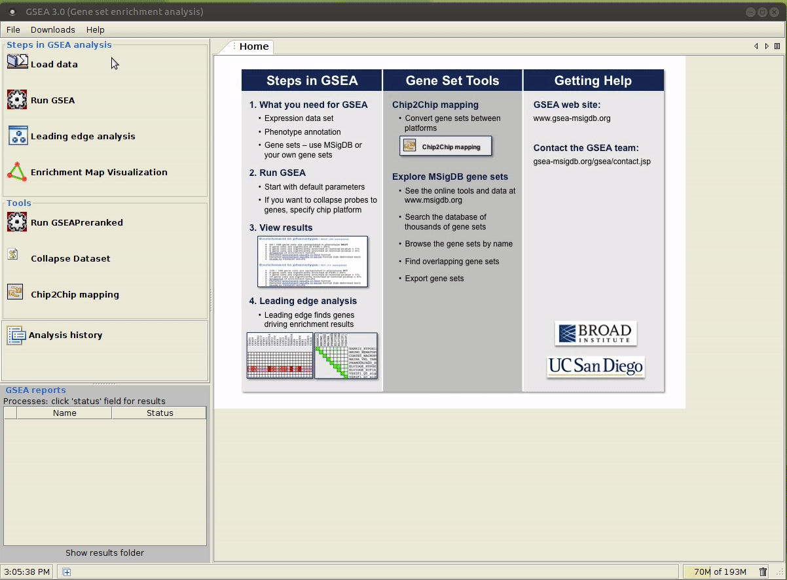
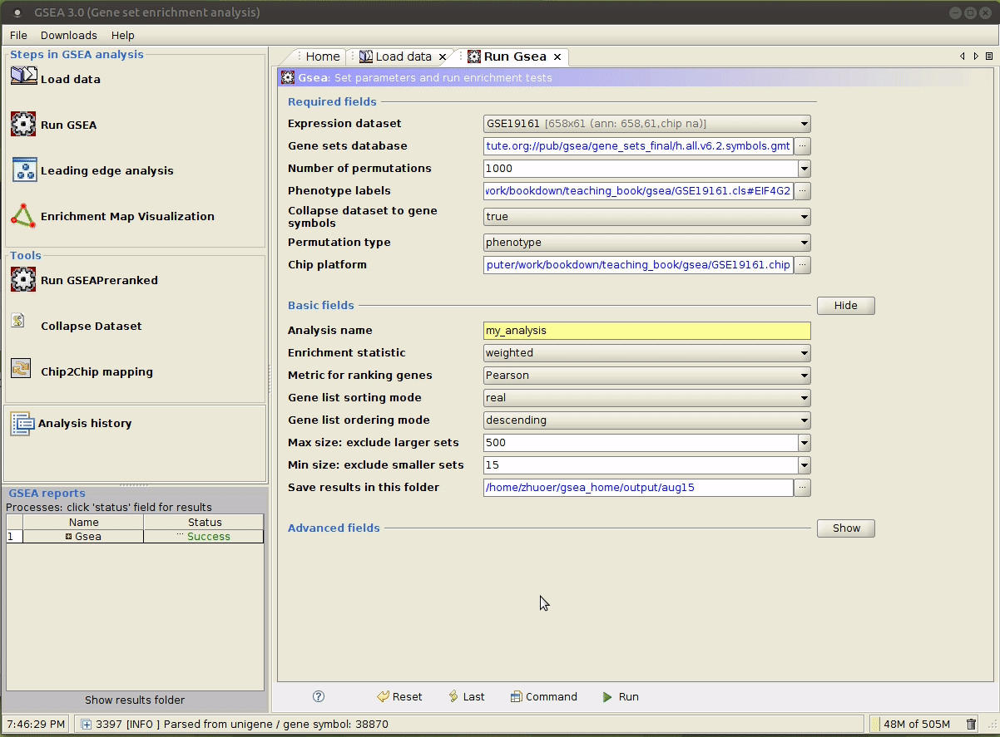

# 4.3. GSEA

## Pipeline


## data structure

### getting software & data {#install-gsea}

- 程序下载与安装（Docker 中均已安装好）：

  - 进入 [GSEA官方下载页面](http://software.broadinstitute.org/gsea/downloads.jsp)
        （需要登录方可进入，只需输入邮箱即可），在 `Software` tab下载 "javaGSEA Java Jar file"
  - 安装 [Java8](http://www.oracle.com/technetwork/java/javase/downloads/index.html) 
  - 可选，安装 qGSEA（打开R）
    
    ```r
    if (!('devtools' %in% .packages(T))) install.packages('devtools')
    devtools::install_github('dongzhuoer/qGSEA')
    ```

-  准备材料：至 <https://www.ncbi.nlm.nih.gov/geo/browse/?view=series&display=20> 找到感兴趣的数据集（如 GSE19161）

### input format

| **File format**       | **Information contained in file** | **File description**                                       |
|-----------------------|-----------------------------------|------------------------------------------------------------|
| res, gct, pcl, or txt | Expression dataset                | Contains expression value for each feature in each sample. |
| cls                   | Phenotype labels                  | Associates each sample with a phenotype.                   |
| gmx or gmt            | Gene sets                         | gives the gene set name and list of features in it.        |
| Chip                  | Chip annotations                  | Lists each probe on and its matching HUGO gene symbol.     |

参见 <http://software.broadinstitute.org/gsea/doc/GSEAUserGuideTEXT.htm#_Preparing_Data_Files>

### output format

网页格式的输出信息。  
参见 <http://software.broadinstitute.org/gsea/doc/GSEAUserGuideTEXT.htm#_Interpreting_GSEA_Results>


## Running Scripts
<!-- for unittest is in docker repo -->
这里我们分析 GSE19161 数据集中与 _EIF4G2_ 基因的表达量显著相关的 gene set。

以下操作均在 `gsea/` 目录下进行，每一步的结果都可以在 `gsea/success/` 的相应文件
    夹中查看。（比如第一步没有在 `gsea/input/` 中生成要求的文件的话，可以直接从 
    `gsea/success/` 中拷贝，然后继续下一步。）

### 准备 GSEA 输入文件 {#gsea-input}

官方指南见 <http://software.broadinstitute.org/cancer/software/gsea/wiki/index.php/Data_formats>

如果你想利用 GEO 的原始数据，[qGSEA](https://github.com/dongzhuoer/qGSEA) 这个R包会让你轻松许多：

1. 获取原始数据（打开R）

   ```r
   dir.create('raw/')

   download.file(rGEO::gse_soft_ftp('GSE19161'), 'raw/GSE19161_family.soft.gz')
   download.file(rGEO::gse_matrix_ftp('GSE19161'), 'raw/GSE19161_series_matrix.txt.gz')
   ```

1. 生成 GSEA 输入文件（打开R）

   ```r
   dir.create('input/')

   qGSEA::make_gsea_input(
       matrix_file = 'raw/GSE19161_series_matrix.txt.gz',
       soft_file = 'raw/GSE19161_family.soft.gz',
       output_dir = 'input/', 
       gene = 'EIF4G2'
   )
   ```

1. 现在目录结构如下：
   <!-- `tree` --->
   ```
   gsea
   ├── input
   │   ├── GSE19161.chip
   │   ├── GSE19161.cls
   │   └── GSE19161.txt
   └── raw
       ├── GSE19161_family.soft.gz
       └── GSE19161_series_matrix.txt.gz
   ```

### 运行GSEA {#gsea-command}

GSEA 可以以图形化界面或 command line 模式运行。由于在 Docker 中无法启动图形化界面，
    而且 GitBook的限制使得本步骤中的动画无法展示，我们将其移到了[这里](#gsea-gui)。
    下面仅介绍如何在 command line 中运行。

官方指南请参见<http://software.broadinstitute.org/gsea/doc/GSEAUserGuideTEXT.htm#_Running_GSEA_from_the%20Command%20Line>。

官方推荐的方法是在图形化界面中运行成功后，点击 `Command` 按钮，即可获取本次运行所用的命令 [^1]。至 [](#gsea-gui)

在实践中，使用默认值的参数也可以不指定。例如，完成图形化界面中示例的最小命令如下：

```
java -cp /usr/local/GSEA/gsea-3.0.jar -Xmx512m xtools.gsea.Gsea \
    -res input/GSE19161.txt -cls input/GSE19161.cls#EIF4G2 -chip input/GSE19161.chip -out output \
    -gmx gseaftp.broadinstitute.org://pub/gsea/gene_sets_final/h.all.v6.2.symbols.gmt -metric Pearson
```

其中第一行指定运行的程序，第二行是输入/输出文件的路径
    （其中 `#EIF4G2` 应该归于下一条）。第三行设置了一些参数，这里我们使用 
    [hallmark](https://doi.org/10.1016/j.cels.2015.12.004) 这个 gene set 
    collection (`h.all.v6.1.symbols.gmt`)；另外，由于我们使用的是连续性表型
    （_EIF4G2_ 基因的表达量），Metric 要选 `Pearson`。
            

输出结果为 `output/my_analysis.Gsea.1534401449035/` （最后的数字每次运行都不尽相同）。
    其中 `my_analysis` 可以用 `-rpt_label` 指定为其它值，如 `-rpt_label GSE19161`。
    但GSEA会自动在其后添加 `Gsea.1534401449035` 来组成输出文件夹名。

## Tips/Utilities

### 常见错误：筛选后无基因集

由于基因芯片仅分析一部分基因，有些 gene set 会因为包含的基因过少而被剔除 [^filter-geneset]。
在极端情况下，可能所有的 gene set 都会被剔除，这时就会发生如下错误：
   


更多信息请参见 <http://software.broadinstitute.org/cancer/software/gsea/wiki/index.php/1001>


### 分析离散型表型


GSEA也可以分析与离散型表型显著相关的 gene set （与差异表达相似），与上文流不同的地方在于 `.cls` 文件。 

以 ["GSE2251"](https://www.ncbi.nlm.nih.gov/geo/query/acc.cgi?acc=GSE2251) 例，
打开连接后，可以在 Samples 一栏找到样品信息。本例共有12个样本，其中第
1, 2, 3, 7, 8, 9 号为"E2-8"，第4, 5, 6, 10, 11, 12 号为"vehicle"。针对这一型的
`.cls` 文件如下所示。`12` 是样本总数，`2` 是表型类型数目，`0` 代表第一种型，`1` 代表第二种表型。
（样本数过多时，网页会显示不全，这时可以解压并打开 `_series_matrix.txt.gz` 查看样本信息。）

```
12 2 1
# E2-8 vehicle
0 0 0 1 1 1 0 0 0 1 1 1
```

### 以图形化界面运行 GSEA {#gsea-gui}

本步骤完成的任务与 [command line 模式](#gsea-command)中完全相同。
由于 GitBook 的限制, 请至[这里](https://dongzhuoer.gitlab.io/lulab-teaching_book/gsea.html#run-gsea)查看本步骤。
       
1. 切换到自己的电脑或虚拟机，[装好全部软件](#install-gsea)，
       新建一个空文件夹 `gsea/`，在其中[准备好输入文件](#gsea-input)。
   
1. 打开 GSEA： `java -jar /path/to/gsea-x.y.jar`，用文件管理器打开 `input/` 文件夹，将上述生成的文件拖拽到指定区域。

   

   图1 载入数据

        参见[GUI流程](#gsea-gui)的第 2 步。

1. 选择合适的参数，参数意义参见 [command line 模式](#gsea-command)第三行。


图2 运行GSEA

1. 运行成功后，`Status` 会显示为 `Success`，点击其即可查看输出（示例输出可参见<https://dongzhuoer.github.io/teaching_book_output/libs/my_analysis.Gsea.1534595192524/index.html>）。在本例中，
        没有一个 gene set 通过了显著性检验。


图3 GSEA 的输出


## Homework and more

1. 分析 GSE2251 中与 _TP53_ 基因的表达量显著相关的 gene set。
1. 分析 GSE2251 中与转染载体（AdERalpha vs AdLacZ）显著相关的 gene set。（提示：需自行生成 `.cls` 文件）

<!-- homework answer

`cd gsea`

```r
download.file(rGEO::gse_soft_ftp('GSE2251'), 'raw/GSE2251_family.soft.gz')
download.file(rGEO::gse_matrix_ftp('GSE2251'), 'raw/GSE2251_series_matrix.txt.gz')


qGSEA::make_gsea_input(
    matrix_file = 'raw/GSE2251_series_matrix.txt.gz', 
    soft_file = 'raw/GSE2251_family.soft.gz',
    'input', 'TP53'
)
```

```bash
java -cp /media/computer/opt/GSEA/gsea-3.0.jar -Xmx512m xtools.gsea.Gsea \
    -res input/GSE2251.txt -cls input/GSE2251.cls#TP53 -chip input/GSE2251.chip -out output \
    -gmx gseaftp.broadinstitute.org://pub/gsea/gene_sets_final/h.all.v6.2.symbols.gmt -metric Pearson

java -cp /media/computer/opt/GSEA/gsea-3.0.jar -Xmx512m xtools.gsea.Gsea \
    -res input/GSE2251.txt -cls input/GSE2251_vector.cls#AdERalpha_versus_AdLacZ -chip input/GSE2251.chip -out output \
    -gmx gseaftp.broadinstitute.org://pub/gsea/gene_sets_final/h.all.v6.2.symbols.gmt
```

-->

脚注 [^1]


[^1]: 从图形化界面获取 command

      
      
      图4 GSEA 获取 command

[^1]: Hello

[^filter-geneset]: 比如某一 gene set 含有 A、B、C、D、E、F 等基因，而某一张芯片只有针对 A、B 的探针，这时 GSEA 就会剔除该基因集。
