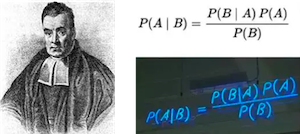

# 8.Machine Learning Basics

## 1. Introduction

### 1\) 机器学习的定义与分类

机器学习研究如何从数据中学习其隐藏的模式并预测未知数据的特征。

根据预测变量是否已知，机器学习通常分为两类：**监督学习**和**无监督学习**。

* 监督学习

模型通过特征和类别标签作为构建模型的输入。如果目标变量（要预测的变量）是类别信息（例如正/负），该问题称为分类问题。如果目标变量是连续的（例如身高）则为回归问题。

* 无监督学习

目标变量是未指定的。模型的目的是确定内部数据的结构（cluster）。在模型拟合之后，我们可以将新来的样本分给cluster或生成与原始数据具有相似分布的样本。无监督学习也可以用于监督学习之前的数据预处理步骤。

### 2\) Data Scaling

对于大多数机器学习算法，建议将feature scale到一个比较小的范围，以减少极端值的影响。

feature的规模过大或者过小都会增加数值不稳定的风险并且还使损失函数更加难以优化。

* 基于线性模型权重的特征选择方法会假定输入的feature在同样的规模上。
* 基于梯度下降算法的模型（比如神经网络）的表现和收敛速度会被没有合理scale的数据显著影响。
* 决策树和随机森林类算法对数据规模不太敏感，因为它们使用rule-based标准。

常见的数据缩放方法包括：

> * standard/z-score scaling
>
> Standard/z-score scaling first shift features to their centers\(mean\) and then divide by their standard deviation. This method is suitable for most continous features of approximately Gaussian distribution.
>
> $$\text{zscore}(x_{ij}^{'}) = \frac{x_{ij} - \mu _{ij}}{\sigma _i}$$
>
> * min-max scaling
>
> Min-max scaling method scales data into range \[0, 1\]. This method is suitable for data concentrated within a range and preserves zero values for sparse data. Min-max scaling is also sensitive to outliers in the data. Try removing outliers or clip data into a range before scaling.
>
> $$\text{minmax}(x_{ij}^{'}) = \frac{x_{ij} - \text{min}_k \mathbf{x}_{ik}} {\text{max}_k x_{ik} - \text{min}_k x_{ik}}$$
>
> * abs-max scaling.
>
> Max-abs scaling method is similar to min-max scaling, but scales data into range \[-1, 1\]. It does not shift/center the data and thus preserves signs \(positive/negative\) of features. Like min-max, max-abs is sensitive to outliers.
>
> $$\text{maxabs}(x_{ij}^{'}) = \frac{x_{ij}}{\text{max}_k \vert x_{ik} \vert}$$
>
> * robust scaling
>
> Robust scaling method use robust statistics \(median, interquartile range\) instead of mean and standard deviation. Median and IQR are less sensitive to outliers. For features with large numbers of outliers or largely deviates from normal distribution, robust scaling is recommended.
>
> $$\text{robustscale}(x_{ij}^{'}) = \frac{x_{ij} - \text{median}_k x_{ik}} {Q_{0.75}(\mathbf{x}_i) - Q_{0.25}(\mathbf{x}_i)}$$

### 3\) 分类问题的评估指标

* **Confusion matrix：**

最常用的评估分类模型表现的方法是构建一个[confusion matrix](https://en.wikipedia.org/wiki/Confusion_matrix).

Confusion matrix会总结模型正确和错误分类的样本数量，并将预测的样本分成如下四类：

|  | True | Positive | Negative |  |
| :--- | :--- | :--- | :--- | :--- |
| **Predicted** |  |  |  |  |
| **Positive** |  | True Positive \(TP\) | False Positive \(FP\) | $$\textbf{PPV} =\frac{TP}{TP+FP}$$ |
| **Negative** |  | False Negative \(FN\) | True Negative \(TN\) | $$\textbf{NPV} =\frac{TN}{TN+FN}$$ |
|  |  | $$\textbf{Sensiticity} = \frac{TP}{TP+FN}$$ | $$\textbf{Specificity} = \frac{TN}{TN+FP}$$ |  |

* **Accuracy \(0 ~ 1\)** 

summarizes both positive and negative predictions, but is biased if the classes are imbalanced:

$$\text{Accuracy} = \frac{TP + TN}{TP + TN + FP + FN}$$

* **Recall/sensitivity \(0 ~ 1\)**

summarizes how well the model finds out positive samples:

$$\text{Recall/Sensitivity} = \frac{TP}{TP + FN}$$

* **Precision/positive predictive value \(PPV\)  \(0 ~ 1\)** 

summarizes how well the model finds out negative samples:

$$\text{Precision/Positive Predictive Value} = \frac{TP}{TP + FP}$$

* **F1 score \(0 ~ 1\)** 

balances between positive predictive value \(PPV\) and true positive rate \(TPR\) and is more suitable for imbalanced dataset:

$$\text{F1 score} = 2 \frac{PPV \cdot TPR}{PPV + TPR}$$

* **Matthews correlation coefficient \(MCC\) \(-1 ~ 1\)** 

another metric that balances between recall and precision:

$$\text{MCC} = \frac{TP \times TN - FP \times FN} {(TP + FN)(TP + FP)(TN + FP)(TN + FN)}$$

* **ROC曲线和Precision-Recall曲线：**

有时，一个固定的cutoff不足以评估模型性能。 Receiver Operating Characterisic（ROC）曲线和Precision-Recall曲线可以通过不同的cutoff评估模型的表现。 ROC曲线和Precision-Recall对于类别不平衡问题也有比较好的评估。与ROC曲线相比，recision-Recall曲线更适合类别极不平衡的数据集。

ROC曲线下面积（AUROC）或average precision \(AP\)是一个单值，它总结了不同截止值下的模型平均表现，常常用于报告模型的分类表现。

可以看到AUROC和AP都接近于1，可以认为模型的分类效果很好。

### 4\) 交叉验证

交叉验证可以被用于在训练集中再随机划分出一部分验证集用于挑选模型的参数，也可以用于直接评估模型的表现。

对于非常大的数据集，将数据集单独拆分为训练集和测试集就足够来评估模型性能。但是，对于小型数据集，测试样本仅代表一小部分未来预测中可能的样本，即对于小数据集，划分出的测试集可能因为样本数过少而不具有代表性。

**示例：K折（k-folds）交叉验证**

在**K折交叉验证**中，数据集被均匀地划分为$$k$$个部分（folds）。在每轮验证中，在剩余的$$\frac{k-1}{k}$$部分上进行训练，并在剩下的一个fold上进行测试。

K折交叉验证确保训练样本和测试样本之间没有重叠，K轮结束后，每个样本会被设置为测试样品一次。最后，模型平均表现是在 $$k$$轮次中计算指标的平均值得到的。

## 2. 休息一会

**Bayes 贝叶斯**

不论是学习概率统计还是机器学习的过程中，**贝叶斯 \(Bayes\)** 总是是绕不过去的一道坎。

据现有资料显示，贝叶斯全名为托马斯·贝叶斯\(Thomas Bayes，1701？-1761\),是一位与牛顿同时代的牧师，是一位业余数学家，平时就思考些有关上帝的事情，当然，统计学家都认为概率这个东西就是上帝在掷骰子。当时贝叶斯发现了古典统计学当中的一些缺点，从而提出了自己的“贝叶斯统计学”，也就是贝叶斯定理。托马斯·贝叶斯的洞察力非常简明。一个假设是真实的概率取决于两个标准：1.根据当前的知识（“先验”），判断它的合理程度；2.评估它与新的证据的契合程度。

但贝叶斯统计当中由于引入了一个主观因素（先验概率），一点都不被当时的人认可。直到20世纪中期，也就是快200年后了，统计学家在古典统计学中遇到了瓶颈，伴随着计算机技术的发展，当统计学家使用贝叶斯统计理论时发现能解决很多之前不能解决的问题，从而贝叶斯统计学一下子火了起来。

> 运用先前的经验和记忆中积累的知识、和意识中提炼出的新证据，我们对日常事物的概率进行分配和生活进行管理。举一个生活中的简单事件：
>
> 接听手机。通常在工作时你将它放在办公桌上，而在家里时把它放在在充电器上。现在你在家里的阳台上浇花，听到屋内电话声响起。新的数据会告诉你它处于室内任何地方，但你仍会直接走向充电器。因为你将的先前对手机位置的认知（通常在办公桌上或家中的充电器上）与新的证据（房屋的某处）相结合，从而确定了它的位置。如果手机不在充电器上，那么你会唤起先前你在某些放置过手机的位置的认知来缩小搜索范围。 你会忽略房子里大部分的地方，如冰箱、袜子抽屉等等，因为这些地方在你先前所积累的认知中被认定为极不可能的位置，你会在最终找到电话之前思考最可能的地方。
>
> 在这个找电话的过程中，你便正在使用贝叶斯定理。
>
> **贝叶斯之谜:**
>
> 1763年12月23日，托马斯·贝叶斯（ Thomas Bayes，1701？-1761 ）的遗产受赠者R.Price牧师在英国皇家学会宣读了贝叶斯的遗作《论机会学说中一个问题的求解》，其中给出了贝叶斯定理，这一天现在被当作贝叶斯定理的诞生日。虽然贝叶斯定理在今天已成为概率论统计最经典的内容之一，但贝叶斯本人却笼罩在谜团之中。
>
> 现有资料表明，贝叶斯是一位神职人员，长期担任英国坦布里奇韦尔斯地方教堂的牧师，他从事数学研究的目的是为了证明上帝的存在。他在1742年当选为英国皇家学会会士，但没有记录表明他此前发表过任何科学或数学论文。他的提名是由皇家学会的重量级人物签署的，但为什么提名以及他为何能当选，至今任是个谜。贝叶斯的研究工作和他本人在他生活的时代很少有人关注，贝叶斯定理出现后很快就被遗忘了，后来大数学家拉普拉斯使它重新被科学界所熟悉，但直到二十世纪随着统计学的广泛应用才备受瞩目。贝叶斯的出生年份至今也没有清楚确定，甚至关于如今广泛流传的他的画像是不是贝叶斯本人，也仍然存在争议。
>
> —— 摘自《机器学习》\(周志华\)

## 3. More Reading

* [Advanced Tutorial](https://lulab.gitbook.io/training/part-iii.-advanced-bioinfo-analyses/introduction-of-part-iii)
  * Machine Learning
  * Feature Selection
  * Deep Learning

