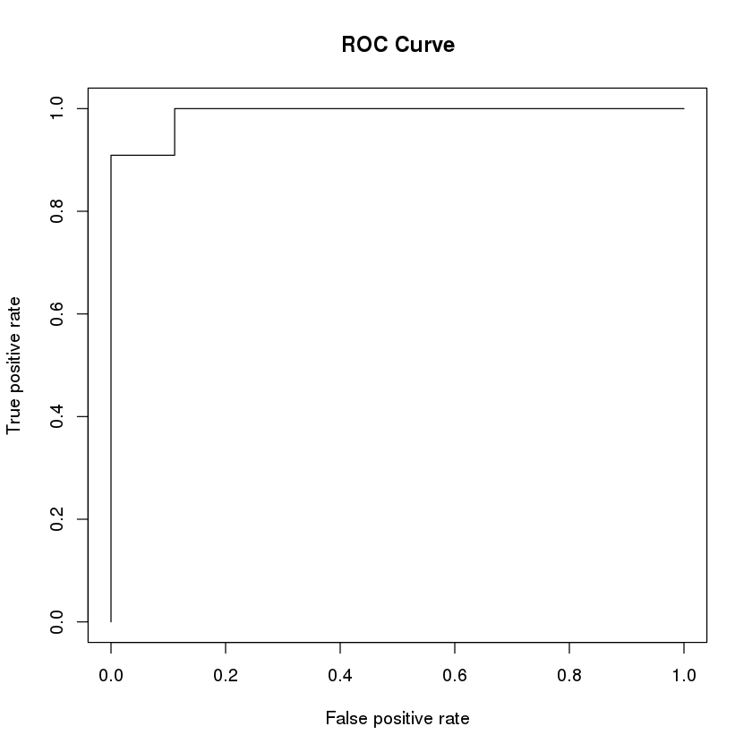

# 8.1 Machine Learning with R

## 1. Practice Guide

我们选用Random Forest模型作为示例讲解机器学习。

### 1) 加载所需R package

运行代码之前需要以下 R packages

* [randomForest](https://cran.r-project.org/web/packages/randomForest/index.html): 构建Random Forest模型
* [ROCR](https://cran.r-project.org/web/packages/ROCR/index.html): 绘制ROC曲线和计算AUC
* [GGally](https://cran.r-project.org/web/packages/GGally/index.html): 画图表示特征之间相关性
* [mlbench](https://cran.r-project.org/web/packages/mlbench/index.html): 常用机器学习数据集


```R
for(pkg in c('randomForest', 'ROCR', 'GGally', 'mlbench')){
  if(!require(pkg, character.only=TRUE)){
    install.packages(pkg)
  }
}
```

设置随机数种子保证本教程的结果可重复


```R
set.seed(1234) 
```

### 2) 加载数据集

我们采用R内置的数据集`iris`，其中包含4个特征和3个类别。每个类别包含50个样本，对应一个花的物种。数据集一共包含150个样本。


```R
head(iris)
```


<table>
<thead><tr><th scope=col>Sepal.Length</th><th scope=col>Sepal.Width</th><th scope=col>Petal.Length</th><th scope=col>Petal.Width</th><th scope=col>Species</th></tr></thead>
<tbody>
	<tr><td>5.1   </td><td>3.5   </td><td>1.4   </td><td>0.2   </td><td>setosa</td></tr>
	<tr><td>4.9   </td><td>3.0   </td><td>1.4   </td><td>0.2   </td><td>setosa</td></tr>
	<tr><td>4.7   </td><td>3.2   </td><td>1.3   </td><td>0.2   </td><td>setosa</td></tr>
	<tr><td>4.6   </td><td>3.1   </td><td>1.5   </td><td>0.2   </td><td>setosa</td></tr>
	<tr><td>5.0   </td><td>3.6   </td><td>1.4   </td><td>0.2   </td><td>setosa</td></tr>
	<tr><td>5.4   </td><td>3.9   </td><td>1.7   </td><td>0.4   </td><td>setosa</td></tr>
</tbody>
</table>


为简单起见，我们只选用`versicolor`和`virginica`两类做二分类问题。


```R
# 去除类别为setosa的样本
df <- iris[iris$Species != 'setosa', ]
# 去除最后一列Species，产生输入矩阵
all_data <- df[, 1:(ncol(df) - 1)]
# 需要预测的类别向量。factor()函数用于把原来的 3 种类别变成 2 种类别
all_classes <- factor(df$Species)
```

### 3) 划分训练集和测试集

我们随机选择80%的样本（80个样本）作为训练集，剩余20%的样本作为测试集。


```R
# 总样本数为输入矩阵的行数
n_samples <- nrow(all_data)
# 计算训练集样本数(80%)
n_train <- floor(n_samples * 0.8)  # Calculate the size of training sets

# 对样本进行随机排列，产生排列的顺序
indices = sample(1:n_samples)

# 选择随机排列后的前80%样本作为训练集
train_data <- all_data[indices[1:n_train],]
train_classes <- all_classes[indices[1:n_train]]
# 选择随机排列后的后20%样本作为测试集
test_data <- all_data[indices[(n_train + 1):n_samples],]
test_classes <- all_classes[indices[(n_train + 1):n_samples]]
```

### 4) 模型训练

以下代码在训练集上训练一个由100棵分类树组成的Random Forest模型：


```R
rf_classifier = randomForest(train_data, train_classes, trees = 100, importance = TRUE)
```

函数返回的变量`rf_classifier`包含了已经训练好的模型：


```R
rf_classifier
```


    
    Call:
     randomForest(x = train_data, y = train_classes, importance = TRUE,      trees = 100) 
                   Type of random forest: classification
                         Number of trees: 500
    No. of variables tried at each split: 2
    
            OOB estimate of  error rate: 8.75%
    Confusion matrix:
               versicolor virginica class.error
    versicolor         36         3  0.07692308
    virginica           4        37  0.09756098


### 5) 模型测试和评估

模型训练完成之后，可用`predict`函数在测试集上进行预测：


```R
predicted_classes <- predict(rf_classifier, test_data)
```

用预测的类别和真实类别可构建一个混淆矩阵（confusion matrix）


```R
# 定义versicolor为正类别
positive_class <- 'versicolor'

# true positive count (TP)
TP <- sum((predicted_classes == positive_class) & (test_classes == positive_class))
# false positive count (FP)
FP <- sum((predicted_classes == positive_class) & (test_classes != positive_class))
# false negative count (FN)
FN <- sum((predicted_classes != positive_class) & (test_classes == positive_class))
# true negative count (TN)
TN <- sum((predicted_classes != positive_class) & (test_classes != positive_class))

# 构建2x2矩阵，填充以上计算的四个数
confusion <- matrix(c(TP, FP, FN, TN), nrow=2, ncol=2, byrow=TRUE)
colnames(confusion) <- c('True versicolor', 'True virginica')
rownames(confusion) <- c('Predicted versicolor', 'Predicted virginica')
confusion
```


<table>
<thead><tr><th></th><th scope=col>True versicolor</th><th scope=col>True virginica</th></tr></thead>
<tbody>
	<tr><th scope=row>Predicted versicolor</th><td>11</td><td>1 </td></tr>
	<tr><th scope=row>Predicted virginica</th><td> 0</td><td>8 </td></tr>
</tbody>
</table>


关于混淆矩阵的计算，可参考(https://en.wikipedia.org/wiki/Confusion_matrix) 获得更多信息。

我们可以基于混淆矩阵计算accuracy、sensitivity、positive predicted value、specificity等评估指标：


```R
print(paste('accuracy =', (TP + TN)/(TP + TN + FP + FN)))
print(paste('sensitivity =', TP/(TP + FN)))
print(paste('positive predicted value =', TP/(TP + FP)))
print(paste('specificity =', TN/(TN + FP)))
```

    [1] "accuracy = 0.95"
    [1] "sensitivity = 1"
    [1] "positive predicted value = 0.916666666666667"
    [1] "specificity = 0.888888888888889"


### 6) ROC曲线

ROC曲线需要两组数据：真实类别和预测某一类别的概率。
首先，调用`predict`函数时加上`type = 'prob'`参数可计算每个类别的概率


```R
predicted_probs <- predict(rf_classifier, test_data, type = 'prob')
```

`predicted_probs`包含两列，对应两个类别


```R
head(predicted_probs)
```


<table>
<thead><tr><th></th><th scope=col>versicolor</th><th scope=col>virginica</th></tr></thead>
<tbody>
	<tr><th scope=row>106</th><td>0.000</td><td>1.000</td></tr>
	<tr><th scope=row>107</th><td>0.954</td><td>0.046</td></tr>
	<tr><th scope=row>79</th><td>0.982</td><td>0.018</td></tr>
	<tr><th scope=row>141</th><td>0.000</td><td>1.000</td></tr>
	<tr><th scope=row>80</th><td>1.000</td><td>0.000</td></tr>
	<tr><th scope=row>64</th><td>0.992</td><td>0.008</td></tr>
</tbody>
</table>


因为我们把`vesicolor`当作正样本，所以只选取预测为正样本的概率来计算ROC：


```R
# 创建一个长度与测试集大小相同的0-1向量，1代表要预测的类别
test_labels <- vector('integer', length(test_classes))
test_labels[test_classes == positive_class] <- 1
# 通过prediction函数，使用预测为正样本的概率和真实类别创建一个对象pred
pred <- prediction(predicted_probs[, positive_class], test_labels)
```

以假阳性率（false positive rate, fpr)为X轴, 真阳性率（true positive rate, tpr）为y轴绘制ROC曲线：


```R
roc <- performance(pred, 'tpr', 'fpr') 
plot(roc, main = 'ROC Curve') 
```





计算ROC曲线下面积（area under the curve, AUC）：


```R
auc <- performance(pred, 'auc')@y.values[[1]]
print(paste('auc =', auc))
```

    [1] "auc = 0.98989898989899"


## 2. Tips

### 1) 特征之间相关性

在模型训练之前，可以计算特征之间相关性，去除冗余的特征。注意特征数较多时，由于计算量很大，不适合分析所有特征之间的相关性。


```R
GGally::ggpairs(df, columns = 1:4, ggplot2::aes(color = Species))
```


## 3. More reading

* [Jupyter Notebook](./8.1-machine-learning-with-r.ipynb) （需要安装Jupyter和

* 本教程代码参考[链接](https://www.blopig.com/blog/2017/04/a-very-basic-introduction-to-random-forests-using-r/)

* 其他机器学习模型相关[代码](https://github.com/urluzhi/scripts/tree/master/Rscript/machine_learning):  
  - `logistic_regression.R`: Logistic Regression
  - `svm.R`: SVM
  - `plot_result.R`: Plot your training and testing performance
  
* [caret](http://topepo.github.io/caret): 用R实现了大量机器学习模型，并包含一个用GitBook教程。

## 4. Homework

学习和使用教程中的代码，使用下面的数据，练习Random Forest，在training set上训练，在test set上预测，汇报模型的prediction performance: 包括 accuracy, sensitivity, specificity, roc\_auc等指标，绘制ROC曲线。

  > **作业要求** ：上交一个文档汇报prediction performance，并解释如上指标所代表的意义，附ROC曲线并解释其意义。

请采用`mlbench`包中的数据集`BreastCancer`：


```R
data('BreastCancer')
head(BreastCancer)
```


<table>
<thead><tr><th scope=col>Id</th><th scope=col>Cl.thickness</th><th scope=col>Cell.size</th><th scope=col>Cell.shape</th><th scope=col>Marg.adhesion</th><th scope=col>Epith.c.size</th><th scope=col>Bare.nuclei</th><th scope=col>Bl.cromatin</th><th scope=col>Normal.nucleoli</th><th scope=col>Mitoses</th><th scope=col>Class</th></tr></thead>
<tbody>
	<tr><td>1000025  </td><td>5        </td><td>1        </td><td>1        </td><td>1        </td><td>2        </td><td>1        </td><td>3        </td><td>1        </td><td>1        </td><td>benign   </td></tr>
	<tr><td>1002945  </td><td>5        </td><td>4        </td><td>4        </td><td>5        </td><td>7        </td><td>10       </td><td>3        </td><td>2        </td><td>1        </td><td>benign   </td></tr>
	<tr><td>1015425  </td><td>3        </td><td>1        </td><td>1        </td><td>1        </td><td>2        </td><td>2        </td><td>3        </td><td>1        </td><td>1        </td><td>benign   </td></tr>
	<tr><td>1016277  </td><td>6        </td><td>8        </td><td>8        </td><td>1        </td><td>3        </td><td>4        </td><td>3        </td><td>7        </td><td>1        </td><td>benign   </td></tr>
	<tr><td>1017023  </td><td>4        </td><td>1        </td><td>1        </td><td>3        </td><td>2        </td><td>1        </td><td>3        </td><td>1        </td><td>1        </td><td>benign   </td></tr>
	<tr><td>1017122  </td><td>8        </td><td>10       </td><td>10       </td><td>8        </td><td>7        </td><td>10       </td><td>9        </td><td>7        </td><td>1        </td><td>malignant</td></tr>
</tbody>
</table>


构建模型之前，需要用以下代码产生所需数据集：


```R
# 去除含有缺失值的样本
df <- na.omit(BreastCancer)
# 去除Id和Class两列，产生输入矩阵
all_data <- df[, 2:(ncol(df) - 1)]
# 把Class这一列作为要预测的类别
all_classes <- df$Class
```

输入为9个特征，均为整数。

输出为两个类别，良性（benign）和恶性（malignant）。

以下时各特征的含义：

* `Cl.thickness`: Clump Thickness
* `Cell.size`: Uniformity of Cell Size
* `Cell.shape`: Uniformity of Cell Shape
* `Marg.adhesion`: Marginal Adhesion
* `Epith.c.size`: Single Epithelial Cell Size
* `Bare.nuclei`: Bare Nuclei
* `Bl.cromatin`: Bland Chromatin
* `Normal.nucleoli`: Normal Nucleoli
* `Mitoses`: Mitoses

如需了解更多关于`BreastCancer`数据集信息，可参考[mlbench](https://cran.r-project.org/web/packages/mlbench/index.html)的文档。
