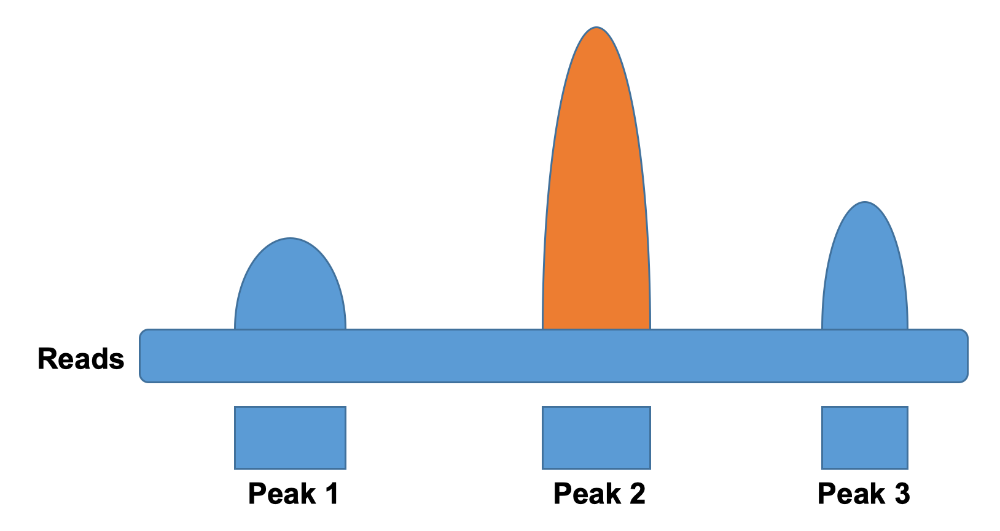
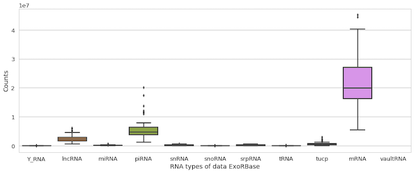
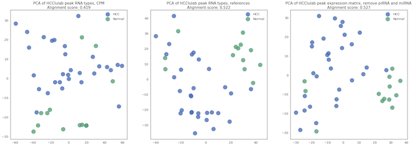
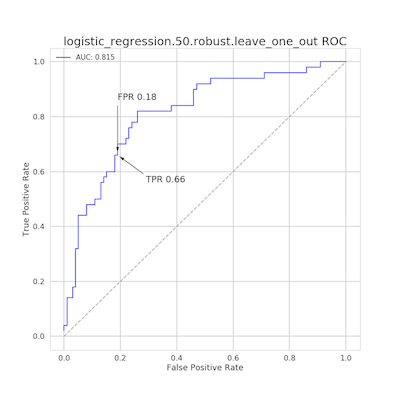

# 11.3 Helps


## **补充知识（选读）**


## 0\) 编程工具介绍

由于完成本次作业需要一定的计算资源支持，我们为各个小组提供了集群账户，每个小组可以最多使用四个核，32G内存。大作业需要使用python完成，推荐读者使用python3。我们需要一些python的工具包来实现部分功能。建议使用jupyter notebook进行代码编辑、运行和调试。本次作业也有可能需要读者使用R，读者同样可以使用jupyter notebook （其中预装了R kernel）来编写、运行R代码。

为了节约时间，我们已经在集群上为读者建立了公共的jupyter使用平台，读者无需配置python、R以及相关的环境，请各小组联系助教获取使用公用jupyter的方法。

```python
#导入必需的库
import gc, argparse, sys, os, errno
%pylab inline
import numpy as np
import pandas as pd
import matplotlib.pyplot as plt
import seaborn as sns
from sklearn.decomposition import PCA
from sklearn.manifold import TSNE
from sklearn.preprocessing import StandardScaler
from sklearn.neighbors import NearestNeighbors
from sklearn.linear_model import LogisticRegression
from sklearn.metrics import roc_curve, auc
from tqdm import tqdm_notebook as tqdm
from scipy.stats import pearsonr
import warnings
warnings.filterwarnings('ignore')

#绘图设置
styles = ["white","dark",'whitegrid',"darkgrid"]
contexts = ['paper','talk','poster','notebook']
sns.set_context(contexts[1])
sns.set_style(styles[2])
tableau20 = np.array([(31, 119, 180), (174, 199, 232), (255, 127, 14), (255, 187, 120),  
             (44, 160, 44), (152, 223, 138), (214, 39, 40), (255, 152, 150),  
             (148, 103, 189), (197, 176, 213), (140, 86, 75), (196, 156, 148),  
             (227, 119, 194), (247, 182, 210), (127, 127, 127), (199, 199, 199),  
             (188, 189, 34), (219, 219, 141), (23, 190, 207), (158, 218, 229)])/255.
```

```text
Populating the interactive namespace from numpy and matplotlib
```

## 1\) Reads Processing and Mapping 指南

完成五个样本`Sample_N1, Sample_N7, Sample_N13, Sample_N19, Sample_N25`的mapping和RNA ratio与length的统计工作，其中产生的bam文件供下一步构建expression matrix使用。

**总体流程图**


### 1.1\) Data Structure

```text
~/proj_exRNA/
|-- data
    |-- RNA_index      #1.2.4 d. 中比对到各种RNA类型的index
    |-- hg38_index     #1.2.4 d. 中最后一步所需要的index
    |-- raw_data
|-- stat               #存放最终步骤的信息统计文件
|-- output             #可以根据自己的习惯对output进行整理，以下是按照流程设置output的路径
eg:
    |-- 01.trim        #对应1.2.2
        |-- QC1        #对应1.2.2 step one
        |-- trim       #对应1.2.2 step two
        |-- QC2        #对应1.2.2 step three
    |-- 02.mapping     #对应1.2.3 和 1.2.4
      |-- 1.no_rRNA
          |-- fastq    #存*.rRNA.unAligned.fastq，详见1.2.3
          |-- sam      #存*.rRNA.sam，详见1.2.3
          |-- rsem_bam #将.sam转化为.bam文件，详见1.2.3
      |-- 2.no_miRNA   
      |-- ...
      |-- 12.no_hg38other
          |-- fastq    
          |-- sam      
          |-- bam      #.sam转.bam工具不同，文件夹由rsem_bam改名至bam
    |-- 03.tags        #homer构建表达矩阵所需路径，本教程不需要建立此路径
        |-- Sample_N1
            |-- miRNA
            |-- ...
        |-- ...
    |-- 04.counts      #构建表达矩阵
    |-- 05.matrix      #构建表达矩阵
    |-- tmp            #存放中间文件
```

**Inputs**

| **File format** | **Information contained in file** | **File description** |
| :--- | :--- | :--- |
| fastq | **reads** | five samples, GEO link: GSE71008 |

**Outputs**

| **File format** | **Information contained in file** |
| :--- | :--- |
| sam/bam | mapped reads to different kinds of indexes |
| tsv format | stats of RNA ratio and length |

### 1.2\) Running Steps

#### **1.2.1\) 获取数据**

从`/BioII/chenxupeng/student/`上获取基因组数据`hg38`，基因组注释数据`/gtf`，索引文件`/RNA_index`以及原始数据`(fastq files)`到自己的账号下

| data | path |
| :--- | :--- |
| `hg38` | `/BioII/chenxupeng/student/data/hg38_index/GRCh38.p10.genome.fa` |
| `gtf` | `/BioII/chenxupeng/student/data/gtf` |
| `RNA index` | `/BioII/chenxupeng/student/data/RNA_index/` |
| `raw data` | `/BioII/chenxupeng/student/data/raw_data/*.fastq` |

推荐使用`ln`或`cp`命令

#### **1.2.2\) QC-Trim-QC**

这步操作目的主要有两个，一个是检查数据的质量，另一个是减掉接头序列

* **Step one - QC of raw data**

**Input:**

| data type | path |
| :--- | :--- |
| `raw data` | `/BioII/chenxupeng/student/data/raw_data/*.fastq` |

**Software/Parameters:**

`fastqc`

| `options` | function |
| :--- | :--- |
| `-q --quiet` | Supress all progress messages on stdout and only report errors. |
| `-o --outdir` | Create all output files in the specified output directory. |
| `-h --help` | detailed introduction of options |

**Output:**

QC files

* **step two - cut adaptor & trim long read**

**Input:**

| data type | **path** |
| :--- | :--- |
| `raw data` | `/BioII/chenxupeng/student/data/raw_data/*.fastq` |

**Software/Parameters:**

`cutadapt`: cutadapt removes adapter sequences from high-throughput sequencing reads.

Usage: `cutadapt -a ADAPTER [options] [-o output.fastq] input.fastq`

| `options with Parameter Setting` | function |
| :--- | :--- |
| `-q 30` | read quality need to be above 30 |
| `-m 16` | reads less than 15nt are removed |
| `-a AGATCGGAAGAGCACACGTCTGAACTCCAGTCAC` | cut adapt |
| `--trim-n` | trim N's on ends of reads. |

**Output:**

`*.cutadapt.fastq`

* **step three - QC after Trim**

输入文件是trim后的数据，过程与step one相同

#### **1.2.3\) Clean rRNA reads**

bowtie2可以将`.fastq`文件比对到rRNA index上从而得到**不含rRNA reads的**`.fastq`**文件以及map到rRNA index上的**`.sam`**文件**

**Input:**

1.2.2 操作结束后的`*.cutadapt.fastq`

**Software/Parameters:**

bowtie2可以Clean rRNA reads得到不含rRNA reads的`.fastq`文件以及map到rRNA index上的`.sam`文件

```text
bowtie2 -p 4 [options] -x <bt2-idx> --un <address of unmapped reads> $input_file [-S <sam>]
```

| `options with Parameter Setting` | function |
| :--- | :--- |
| `--sensitive-local` | (default) allow no mismatch, etc |
| `--norc` | do not align reverse-complement version of read |
| `--no-unal` | suppress SAM records for unaligned reads |
| `--un` `<path to unmapped reads>` | store unmapped reads |
| `-x` `<path to index>/rRNA` | indexed genome/transcriptome |
| `-S` `<path to output file>` | output file foramt as sam |

对于那些map到rRNA index上的`.sam`文件，可以用`rsem-tbam2gbam`命令转化为`.bam`文件。

```text
rsem-tbam2gbam <rRNA-idx> <sam> genome_bam_output
```

**Output:**

不含rRNA reads的`.fastq`文件`*.rRNA.unAligned.fastq`，位于fastq文件夹下，详见Data Structure

map到rRNA index上的`*.rRNA.sam`文件，位于sam文件夹下

以及`*.<rRNA>.rsem.clean.bam`文件，位于rsem\_bam文件夹下

#### **1.2.4\) Sequential Mapping**

这步的目的就是得到比对到各种RNA类型（例如miRNA, piRNA, Y RNA和srp RNA等等）的index后得到的`.sam`文件，mapping的过程就类似于clean rRNA reads的过程。

只不过，1.2.3 比对的index是rRNA，这里只需要 1）**把index替换成其他类型的index**，2）**将上一步比对得到的**`*.<some type of RNA>.unAligned.fastq`**作为input**，重复1）2），直至比对完所有类型至这样就可以得到各种RNA类型的比对结果。

**Input:**

`*.rRNA.unAligned.fastq`

**Software/Parameters:**

类似1.2.3，只需修改index和input：

```text
bowtie2 -p 4 [options] -x <some type of RNA-idx> --un <address of unmapped reads> $input_file [-S <sam>]
```

| `Parameter Setting` |
| :--- |
| `-x` `<path to index>/<some type of RNA>` |
| `*.<some type of RNA>.unAligned.fastq`, output of the previous step, as `$input_file` |
| `-un` `<path to output>/*.<some type of RNA>.unAligned.fastq` |
| `-S` `<path to .sam file>/<some type of RNA>.sam` |

对于那些map到 index上的`.sam`文件，可以用`rsem-tbam2gbam`命令转化为`.bam`文件。

对于map到hg38上的`.sam`文件，可以用samtools的view功能转化为`.bam`文件，具体可以敲入`samtools view -h`查看怎么转化

**Output:**

不含某类型RNA reads的`.fastq`文件`*.<some type of RNA>.unAligned.fastq` 

map到某类型RNA index上的`*.<some type of RNA>.sam`文件

以及`*.<some type of RNA>.rsem.clean.bam`文件

**提示:**

* reads依次map到各种类型的RNA index上，推荐次序为，`miRNA、piRNA、Y_RNA、srpRNA、tRNA、snRNA、snoRNA、lncRNA、mRNA、tucp`，最后是`hg38other`
* map的最后一步非常特殊，1）index不再是RNA\_index，是hg38,不在RNA\_index文件夹下，需要注意 2）sam转bam工具也有所不同，输出文件理论上不再应该是`*.hg38other.rsem.clean.bam`而是`*.hg38other.bam`，但是文件名的设置会影响后续代码简洁性，需要注意

#### **1.2.5\) length & ratio**

对mapping到不同RNA类型的index的reads，我们可以统计其长度，观察其不同RNA类型的长度分布；我们还可以统计不同RNA类型的reads所占比例，作为sample QC的参考。

**length**

这里提供统计长度的.sh，脚本位置在`/BioII/chenxupeng/student/bin/length.sh`，可以得到包含长度信息的文件

该脚本得到的包含长度信息的文件可以用python读取并作格式精简处理，精简处理的结果可以用来可视化。同时，`/BioII/chenxupeng/student/data/other_annotations/length/`文件夹下有除五个样本之外的其余统计好的包含长度信息的文件，格式与运行`length.sh`得到的结果一致。

```text
import pandas as pd
def get_length_table(samplename):
    '''
    sample name: Sample_N14
    '''
    pd.read_table('/BioII/chenxupeng/student/data/other_annotations/length/'+samplename+'.lengthN.stat.tsv')
    df = pd.read_table('/BioII/chenxupeng/student/data/other_annotations/length/'+samplename+'.lengthN.stat.tsv')
    df = df.pivot(index='type',columns='len',values='num')
    df = df.fillna(0)
    return df
get_length_table('Sample_N14')
```
这段代码核心功能是`df.pivot`，将文件的数据以type为index以len为columns重新排列，可以用3.2）的line plot of length画不同read长度的reads数的分布图。用`*.apply(lambda x: (x/x.sum()))`语句可以实现归一化，便可以画不同read长度的reads比例的分布图。

包含长度信息的文件类似如下：
每一行表示sample = Sample_N1, type = < some type of RNA >, 碱基数len = < int > 的read数为num = < int >

| sample | type | len | num |
| :--- | :--- | :--- | :--- |
| Sample_N1 | rRNA | 16 | 4569 |
| Sample_N1 | rRNA | 17 | 13178 |
| Sample_N1 | rRNA | ... | ... |
| Sample_N1 | rRNA | 51 | ... |
| Sample_N1 | miRNA | 16 | ... |
| Sample_N1 | miRNA | ... | ... |
| Sample_N1 | miRNA | 51 | ... |
| Sample_N1 | ... | ... | ... |
| Sample_N1 | hg38other | 16 | ... |
| Sample_N1 | hg38other | ... | ... |
| Sample_N1 | hg38other | 51 | ... |

**ratio**

这里提供统计属于不同RNA的read数量的.sh脚本，位置在`/BioII/chenxupeng/student/bin/read.sh`，可以得到包含read数量信息的文件

该脚本得到的包含read数量信息的文件可以用python读取并作格式精简处理，精简处理的结果可以用来可视化。同时，`/BioII/chenxupeng/student/data/other_annotations/counts/`文件夹下有除五个样本之外的其余统计好的包含read数量信息的文件，格式与运行`read.sh`得到的结果一致。

```text
def get_counts(samplename):
    '''
    samplename: Sample_N14
    '''
    df = pd.read_table('/BioII/chenxupeng/student/data/other_annotations/counts/'+samplename+'.readsN.stat.tsv',
              names=['sample','method','type','counts']).pivot(index='type',columns='sample',values='counts')
    return df
get_counts('Sample_N14')

```
包含read数量信息的文件类似如下，对于column1 row2的13178信息，它表示Sample_N1经过preprocess中的cutadpat操作后留下的reads数目；对于column3的各个属性的含义，libSizeN表示rawdata的reads数目，rRNA_N表示map到rRNA index上的reads的数目，keptN表示去除rRNA后fastq文件剩余的reads的数目，sequentialMap的< some type of RNA >表示map到< some type of RNA > index上的reads的数目，hg38other表示map到hg38的reads的数目，nonHuman_N表示未map的reads的数目：

|  |  |  |  |
| :--- | :--- | :--- | :--- |
| Sample_N1 | preprocess | libSizeN | 13190 |
| Sample_N1 | preprocess | cleanN | 13178 |
| Sample_N1 | preprocess | rRNA_N | ... |
| Sample_N1 | preprocess | keptN | ... |
| Sample_N1 | sequentialMap | miRNA | ... |
| Sample_N1 | sequentialMap | piRNA | ... |
| Sample_N1 | sequentialMap | Y_RNA | ... |
| Sample_N1 | sequentialMap | snRNA | ... |
| Sample_N1 | sequentialMap | snoRNA | ... |
| Sample_N1 | sequentialMap | srpRNA | ... |
| Sample_N1 | sequentialMap | tRNA | ... |
| Sample_N1 | sequentialMap | lncRNA | ... |
| Sample_N1 | sequentialMap | mRNA | ... |
| Sample_N1 | sequentialMap | tucp | ... |
| Sample_N1 | map2hg38other | hg38other | ... |
| Sample_N1 | map2hg38other | nonHuman_N | ... |

[**其他参考教程**](https://lulab.gitbook.io/training/part-ii.-basic-bioinfo-analyses/1.mapping-annotation-and-qc)

## 2\) Construct Expression Matrix 指南

完成五个样本`Sample_N1, Sample_N7, Sample_N13, Sample_N19, Sample_N25`的expression matrix构建工作，使用mapping产生的bam文件，使用`Sample_N1, Sample_N7`的counts检查mapping和construct expression matrix是否有误。

### 2.1\) Data Structure

**inputs**

| **File format** | **Information contained in file** | **File description** | **Notes** |
| :--- | :--- | :--- | :--- |
| bam | **alignments** | Produced by mapping reads to the transcriptome. | Reads are trimmed using a proprietary version of cutAdapt. We map to transcriptome for a better sensitivity \(see details in protocol and example\). |

**outputs**

| **File format** | **Information contained in file** | **File description** | **Notes** |
| :--- | :--- | :--- | :--- |
| tsv | **gene \(ncRNA\) quantifications** | Non-normalized counts. |  |

### 2.2\) Running Scripts

#### **2.2.1\) Software/Tools**

* FeatureCounts

#### 2.2.2\) FeatureCounts

对Mapping步骤得到的不同样本不同RNA类型的`<sample>.<some type of RNA>.rsem.clean.bam`文件，进行Raw Counts的统计（无需统计hg38other），结果可输出到`.../04.counts/<sample>/<sample>.<some type of RNA>.featureCounts.counts`

Reads比对到RNA indexes后，每条Read都标记了位置。需要将位置信息由transcript的位置转变为genome的位置，才能用FeatureCounts将它与gtf比较，统计每个transcript_id的counts。

**Input1:**

`.../04.counts/02.mapping/*.no_<some type of RNA>/rsem_bam/<sample>.<some type of RNA>.rsem.clean.bam`

`<annotation_file>:/BioII/chenxupeng/student/data/gtf/<some type of RNA>.gtf`

**Software usage:**

```text
featureCounts  -t exon -g transcript_id -s 1 -a <annotation_file> -o <output_file> input_file1
```

**Output:**

`<sample>.<some type of RNA>.featureCounts.counts`

### 2.3\) Merge不同RNA类型的Raw Counts

上步操作我们得到不同样本不同RNA类型的Raw Counts，现在要将这些文件合并为一个文件，代码位置在`/BioII/chenxupeng/student/bin/merge.sh`。

`proj_exRNA.featureCounts.counts.merged.mx`就是我们需要的文件

### 2.4\) 检查结果正确性

用`Sample_N1, Sample_N7`的expression matrix数据和`/BioII/chenxupeng/student/data/expression_matrix/GSE71008.txt`中相应的两个样本的参考数据计算相关系数以检查结果。可以使用pearsonr correlation coefficient衡量相关性。

$$PCC = \frac{cov(X,Y)}{\sigma X \sigma Y}$$

```python
from scipy.stats import pearsonr
pearsonr(X,Y)
```

python参考代码位于`/BioII/chenxupeng/student/bin/corr.py`

存在两个gtf文件包含一条相同的exon注释信息，导致产生的mx存在两行，它们的`transcript`一致，而在把mx的这些counts与路径下已经存在其他样本的counts合并为一个mx过程中，如果存在上述问题，便出现拼接失败的报错信息。

解决办法：
```
#仅作参考
#找到`transcript`出现duplicated的位置，第二行代码返回duplicated的位置，第三行实现删除
judge = mx.duplicated('geneID')
judge[judge==1]
mx=mx.drop([821794])
mx=mx.set_index('geneID')
mx.shape
```
合并代码用参考：`pd.concat([ref, mx], axis=1, join_axes=[ref.index])`

### 2.5\) 使用Domain Feature（选做）

由于我们使用的数据是小RNA测序数据，除了使用full length数据来构建expression matrix，另一种思路是考虑使用peak calling的方法来获得domain feature作为expression matrix。如使用[piranha](https://github.com/smithlabcode/piranha)等工具call peak。

我们需要在mapping完成后，对reads所map到的gene，通过分析reads在全长上的位置，找到reads覆盖区域的峰值，以peak区域取代全长区域作为expression matrix的feature。



请完成五个样本`Sample_N1, Sample_N7, Sample_N13, Sample_N19, Sample_N25`的expression matrix构建工作，使用mapping产生的bam文件，使用`Sample_N1, Sample_N7`的counts检查mapping和construct expression matrix是否有误。

我们提供了`Snakefile`文件，输入为mapping得到的`bam`文件，输出为构建好的expression matrix，只需要保证输入文件的路径正确，然后执行：

```text
snakemake -s Snakefile
```

即可产生结果。我们也提供了其他样本的domain feature构建的expression matrix，读者可以在后续步骤比较full length和domain feature的分类效果，根据工作量会酌情加分。

[**其他参考教程**](https://lulab.gitbook.io/training/part-ii.-basic-bioinfo-analyses/2.expression-matrix)

## 3\) 数据分析和质量控制指南

**注意，上一步获得的自己map的五个样本也需要加入到统计中，不能只统计已经提供的样本的信息**

### 3.1\) 基本信息统计

**统计不同RNA类型reads的比例并以饼图展示**


**统计不同RNA类型mapped reads的长度分布**


**统计一套数据中不同RNA type在不同样本的counts**



**统计某套数据中某种类型的RNA在不同样本中的counts数量。**


**分析每个样本不同RNA所占的比例**

 

### 3.2\) 代码示例

**pie plot of ratio**

```python
rnanames = ['miRNA', 'piRNA', 'Y_RNA', 'snRNA','srpRNA','tRNA',
            'lncRNA','mRNA','other_genomic_region','non_human',
            ]
rna_ratio = pd.read_table(file1)
x = rnanames
colours = tableau20[:len(x)]/255.
y = rna_ratio.mean()
z = np.array([float('{:.4f}'.format(y[i])) for i in range(y.shape[0])])*100

fig1, ax1 = plt.subplots(figsize=(10,10))
patches, texts = ax1.pie(y,  colors=colours, #autopct='%1.1f%%',
                        shadow=True, startangle=90)

labels = ['{0} - {1:1.2f} %'.format(i,j) for i,j in zip(x, z)]

sort_legend = True
if sort_legend:
    patches, labels, dummy =  zip(*sorted(zip(patches, labels, y),
                                          key=lambda x: x[2],
                                          reverse=True))

plt.legend(patches, labels, loc='center', bbox_to_anchor=(1.1, .7),
           fontsize=8)
```

**line plot of length**

```python
lengthdata = pd.read_table(file2)
length = np.array(lengthdata.T)
fig,ax=plt.subplots(10,1,figsize=(20,50))
for i in range(length.shape[0]):
    ax[i].plot(length[i],label=rnanames[i],color=colours[i])
    ax[i].legend(loc='upper right')
    ax[i].set_xticklabels(np.arange(lengthdata.index[0]-5,lengthdata.index[-1],5))
```

**boxplot of ratio**

```python
fig, ax = plt.subplots(figsize=(100,20))
sns.boxplot(data =  rna_ratio,ax=ax,boxprops=dict(alpha=.5))
ax.set_title(u'RNA percentage in different samples',fontsize=80)
ax.set_xticks(range(10))
ax.set_xticklabels(rnanames,fontsize=40)
ax.set_yticks(np.arange(0,1,0.1))
ax.set_yticklabels(['{:.1f}%'.format(i*10) for i in range(10)],fontsize=40)
```

### 3.3\) sample QC

为了让比对结果更让人信服，我们基于不同RNA类型reads的比例制定了一套标准用于对样本进行质量控制：

| **Check point** | **Threshold** | **Notes** |
| :--- | :--- | :--- |
| Raw reads quality | reads quality &gt;28 \(median lines in green area\) | Check fastqc results\(\*.html\) |
| Clean reads number | **&gt; 10 million** | Adaptors and too-short sequences removed reads |
| rRNAs% | **&lt; 10%** | Reads mapped to rRNAs \(all following % are divided by the **total number of clean reads**\) |
| HG% | &gt; 60% \(optional\) | Reads mapped to Human Genome **except rRNAs** |
| Transcriptome% | **&gt; 50%** | Reads mapped to Human **Transcriptome** \(including rRNA, miRNA, piRNA, Y RNA, srpRNA, snRNA, snoRNA, tRNA, mRNA exons, lncRNA exons, TUCP exons\) |
| Y RNA% | **10%~65%** | Reads mapped to Y RNA |
| miRNA% | **10%~65% \(**up to 80% for exoRNAs**\)** | Reads mapped to miRNA |

请读者依据以上标准，对样本进行质量控制，并且可以可视化质量控制的条件

## 4\) 矩阵处理指南

### 4.1\) 相关教程

* [normalization](https://youngleebbs.gitbook.io/bioinfo-training/part-ii/4.-qc-and-normalization)
* [deal with confounders](https://youngleebbs.gitbook.io/bioinfo-training/part-ii/5.-imputation-and-confounders)

### 4.2\) Data Normalization

注意此处的normalization是对每个样本的系统误差（如测序深度）进行的，对feature进行normalization（如每列normalize到0-1）请在下一步feature selection中完成。

**不同normalization策略比较**

* 使用CPM\(counts per million\)
* 或者使用可能的内参基因：`'MIR1228', 'MIR16-1', 'MIR16-2', 'MIR21', 'MIR23A', 'MIR23B', 'MIR23C', 'MIR451A', 'MIR15A', 'MIR15B'` 进行scale。
* 去除piRNA和miRNA后使用CPM\(counts per million\)
* 使用SCNorm, RLE, TMM等package



**内参基因的选择**

我们可以绘制density plot或者violin plot来分析不同内参基因的变异系数，选择变异系数小的，比较稳定的miRNA作为内参。可以看到MIR1228, MIR15B的变异系数较大，不够稳定，不应该作为内参

 

### 4.3\) remove batch effect

**visualize batch effect**


**不同去除batch effect方法**

* RUVs，可以设置factor的数量
* Combat，需要给定batch信息

### 4.4\) 通过alignment score量化PCA和t-SNE可视化结果

PCA和t-SNE可以直观的看到样本目前的聚集程度，但是无法量化，尤其是不容易做比较，我们提供以下的两个函数_alignment\_socre_ & _knn\_score_分别量化二分类和多分类样本的聚集程度。数值越接近1说明同类样本越聚集。**利用这种方法读者可以量化自己使用的normalization和remove batch effect方法的效果**。

```python
def alignment_score(X, y, K=10):
    N = X.shape[0]
    nn = NearestNeighbors(K)
    nn.fit(X)
    distances, indices = nn.kneighbors(X, K + 1)
    neighbor_classes = np.take(y, indices[:, 1:])
    same_class_fractions = np.sum(neighbor_classes == y[:, np.newaxis], axis=1)
    score = 1.0 - (np.mean(same_class_fractions) - K/N)/(K - K/N)
    print (same_class_fractions.shape,np.mean(same_class_fractions),K/N,neighbor_classes)
    return score
def knn_score(X, y, K=10):
    N = X.shape[0]
    assert K < N
    nn = NearestNeighbors(K)
    nn.fit(X)

    distances, indices = nn.kneighbors(X, K + 1)
    neighbor_classes = np.take(y, indices[:, 1:])
    same_class_fractions = np.sum(neighbor_classes == y[:, np.newaxis], axis=1)

    classes, counts = np.unique(y, return_counts=True)
    classes = np.argmax(y.reshape((-1, 1)) == classes.reshape((1, -1)), axis=1)
    counts = np.take(counts, classes)
    mean_r = K/(N - 1)*counts
    max_r = np.minimum(K, counts)
    #print (same_class_fractions.shape,mean_r.shape,max_r.shape)
    #scores = (np.mean(same_class_fractions) - mean_r)/(max_r - mean_r)
    scores = (same_class_fractions - mean_r)/(max_r - mean_r)
    #print(scores)
    return scores.mean()
```

如下图所示，可以通过_knn\_score_计算出以batch信息所谓label时scirep数据的alignment score。0.27996表示不同batch的分离程度比较差，基本混合在一起


### 4.5\) 矩阵处理部分代码示例

**注意，本部分代码均由R语言书写**

**SCNorm**

```r
library('SCnorm')
m <- read.csv(filename, sep='\t',row.names = 1,header=TRUE)
Conditions = rep(1, dim(m)[2])
DataNorm <- SCnorm(Data = m, Conditions = Conditions, PrintProgressPlots = TRUE, NCores = 4)
NormalizedData <- results(DataNorm)
write.table(NormalizedData, file=savename, sep='\t', quote=FALSE, row.names=TRUE, col.names=TRUE)
```

**TMM and RLE**

```r
example_sce <- SingleCellExperiment(
    assays = list(counts = as.matrix(scirepcounts)), 
    colData = samples_scirep
)
keep_gene <- rowSums(counts(example_sce)) > 0
example_sce <- example_sce[keep_gene,]
## Apply TMM normalisation taking into account all genes
example_sce <- normaliseExprs(example_sce, method = "TMM")
## normalize the object using the saved size factors
example_sce <- normalize(example_sce)


## Apply RLE normalisation taking into account all genes
example_sce <- normaliseExprs(example_sce, method = "RLE")
## normalize the object using the saved size factors
example_sce <- normalize(example_sce)
```

**RUVs**

```r
library(EDASeq)
library(RUVSeq)
library(sva)
library(scRNA.seq.funcs)
scIdx <- matrix(-1, ncol = max(table(samples_scirep$label)), nrow = 2)
tmp <- which(samples_scirep$label == "Colorectal Cancer")
scIdx[1, 1:length(tmp)] <- tmp
tmp <- which(samples_scirep$label == "Healthy Control")
scIdx[2, 1:length(tmp)] <- tmp
cIdx <- rownames(scirepcpm)
ruvs <- RUVs(as.matrix(scirepcpm), cIdx, k = 10, scIdx = scIdx, isLog = TRUE)
```

**Combat**

```r
#mod_data <- scirepcpm
combat_data <-scirepcpm
mod_data <- as.data.frame(t(combat_data))
# Basic batch removal
mod0 = model.matrix(~ 1, data = mod_data) 
# Preserve biological variability
mod1 = model.matrix(~ samples_scirep$label, data = mod_data) 
# adjust for total genes detected
#mod2 = model.matrix(~ reads.qc$total_features, data = mod_data)
combat <- ComBat(
    dat = t(mod_data), 
    batch = factor(scirepbatch$RNA.Isolation.batch), 
    mod = mod1,
    par.prior = TRUE,
    prior.plots = FALSE
)
```

## 5\) 特征选择指南

[**参考教程**](https://lulab.gitbook.io/training/part-iii.-advanced-bioinfo-analyses/2.feature-selection)

### 5.1\) 对feature做scale

对feature做scale比较简单，可以使用`sklearn.preprocessing`中`MaxAbsScaler/MinMaxScaler/RobustScaler/StandardScaler`的任意一个。

```python
random_state = np.random.RandomState(1289237)
x = random_state.normal(10, 2, size=1000)
from sklearn.preprocessing import StandardScaler, MinMaxScaler, MaxAbsScaler, RobustScaler
scalers = {
    'Standard': StandardScaler(),
    'MinMax': MinMaxScaler(),
    'MaxAbs': MaxAbsScaler(),
    'Robust': RobustScaler()
}
scalernames = ['Standard','MinMax','MaxAbs','Robust']
fig, axes = plt.subplots(1,4, figsize=(20, 4))
for i in range(4):
    x_scaled = scalers[scalernames[i]].fit_transform(x.reshape(-1,1)).ravel()
    sns.distplot(x_scaled, ax=axes[i])
    axes[i].set_title(scalernames[i])
```


## 6\) 模型评估与特征解释指南

### 6.1\) 特征选择结果可视化

使用seaborn的clustermap功能，将挑选出的feature的counts（做过合适的scale）绘制heatmap图并聚类，上方的颜色表示类别，可见同一类被很好的聚在了一起。


### 6.2\) 用选出的feature进行分类并绘制ROC曲线

请特别注意，这里的ROC曲线有其特殊之处。针对我们样本很少的问题，我们不能专门划分出一部分测试集供测试和绘制曲线。我们使用两种方式划分数据集：

* leave one out, 即每轮随机选择一个样本作为validation set，其他样本作为训练集，对validation set进行预测，最终保证每个样本恰好作为validation set一次。
* shuffle split, 即每轮随机选择一些样本作为validation set，其他样本作为训练集，对validation set进行预测，最终每个样本可能在不同轮中一共被预测数次。
* 这样，对于leave one out方法，我们恰好可以将所有样本预测一遍，并绘制出ROC曲线，如下图所示。
* 而对于shuffle split方法，每个样本被预测多次，没法放在一起绘制ROC曲线，但是其每轮都可以单独画一条ROC曲线，下面的图片展示的即为“将各条曲线综合起来”的情况，我们使用阴影区域表示每个点的均值的置信区间。

 

### 6.3\) 用AUC评估挑选不同数量feature的效果

读者可以分析挑选不同数量的feature时模型的拟合效果，评估指标为AUC


### 6.4\) 比较不同的模型和参数挑出的feature的差异

图中有颜色的色块儿表示在该参数条件下被选中的feature，可以发现线性模型挑出的feature更相似，而random forest在不同参数设置下挑出的feature比较稳定。


### 6.5\) 查看feature的robustness（鲁棒性）

每一列是一轮测试，可以发现大多数feature在每轮测试中都被挑中，证明这些feature具有很强的鲁棒性，我们可以设置一个阈值，选取在超过50%的轮数中都出现的feature作为最终选择的feature。


### 6.6\) 利用Venn图分析feature的重合

这里利用Venn图分析了HCC三种类型的数据（full length, peak, peak\_iterative）的重合情况，每一个子图是一个模型。


