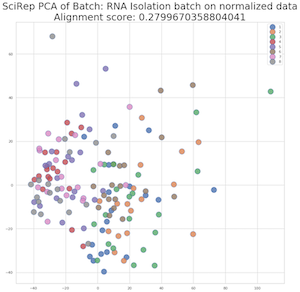
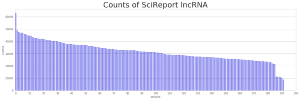
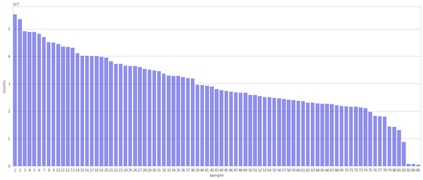
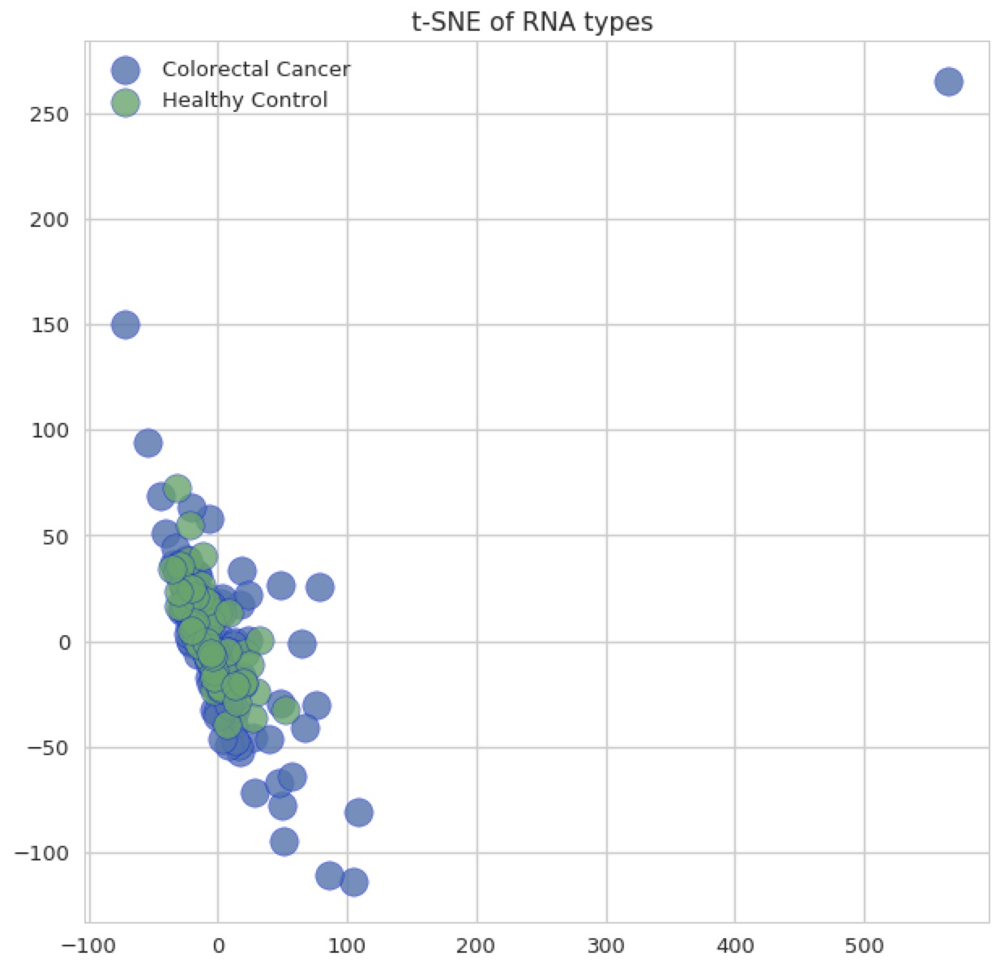
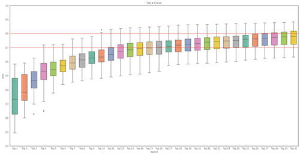
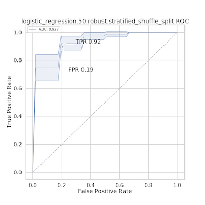
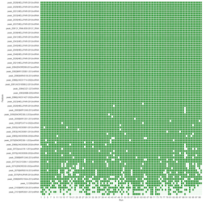

# 从exRNA测序数据中鉴定癌症的生物标志物


```python
在[quiz_exrna_tutorial_shared](https://cloud.tsinghua.edu.cn/f/3f4fc999720d45f198ca/)下载相关文件。
```

请在[quiz_exrna_tutorial_shared](https://cloud.tsinghua.edu.cn/f/3f4fc999720d45f198ca/)下载相关文件，并下载该[文件夹](https://github.com/lulab/teaching_book/tree/master/quiz/quiz_exrna)下的内容，打开`quiz_exrna_tutorial.ipynb`文件阅读详细的**Quiz指南**。

## 背景介绍
（adapt from Young Lee）

在多种体液中，如血清、唾液以及尿液等，可以检测到一类非侵入性细胞外 RNA (extracellular RNA, exRNA)。诸如环状RNA (circular RNA)等这类具有空间结构的 RNA 分子，能够在血浆中稳定存在。这些从细胞分泌出的 exRNA 通常由微囊泡 (microvesicles)、外泌体(exosome) 包裹，或者与 RBP 密切结合形成 RNP 复合体。因为这些分子由于具备类细胞膜结构和蛋白质的保护，加上某些 RNA 具有特定的结构，exRNA 在多种体液 (血清、唾液、尿液等) 中可以抵抗体液中 RNase 的降解，从而稳定存在。exRNA 包括的类型很多，例如 miRNA，Y RNA, circRNA，lncRNA 等，每种又有不同的加工、剪切和修饰产物，这种多样性为更 好的临床检验带来了新的期望。这些 exRNA 可以成为一类有效的生物标志物，服务于人体健康状况检测和疾病的诊断，如癌症的早期诊断、肿瘤生长状况监测、以及预后辅助诊断。

本Quiz依托于Lulab现有的一些研究结果，希望读者通过生物信息学方法，尝试使用一些机器学习方法，发现和研究与癌症发生发展相关的新型体液胞外RNA (extracellular RNA，exRNA)生物标志物，并应用于几种国内高致死癌症的早期诊断和预后辅助治疗。我们将在癌症病人体液 (如血液)中的游离、微囊泡、外泌体、RNP 等不同组分中发现和鉴定标志癌症发生发展的新型 exRNA，构建模型，最终建立一个具有更高精准度和重复性的无创检验癌症（尤其是早期癌症）的方法。


## 编程工具介绍

## 编程工具介绍


大作业需要使用python完成，推荐读者使用python3。我们需要一些python的工具包来实现部分功能。推荐使用包管理软件Anaconda来预装一些必需的包以及安装其他需要的包。另外强烈建议使用jupyter notebook进行代码编辑、运行和调试。具体使用方法请参考教程[Anaconda 和 jupyter](https://lulab.gitbooks.io/teaching/content/part-iii.-machine-learning-basics/python_tutorial.html)相关指南。
如果本地缺少下列可能需要的包，请使用`pip`或者`conda`进行安装。如:

```
pip install tqdm
conda install sklearn
```

本作业的部分内容可能会涉及到R，推荐读者使用[Rstudio](https://www.rstudio.com/)，也可以在jupyter notebook中安装R kernel


```python
#导入必需的库
import gc, argparse, sys, os, errno
%pylab inline
import numpy as np
import pandas as pd
import matplotlib.pyplot as plt
import seaborn as sns
from sklearn.decomposition import PCA
from sklearn.manifold import TSNE
from sklearn.preprocessing import StandardScaler
from sklearn.neighbors import NearestNeighbors
from sklearn.linear_model import LogisticRegression
from sklearn.metrics import roc_curve, auc
from tqdm import tqdm_notebook as tqdm
from scipy.stats import pearsonr
import warnings
warnings.filterwarnings('ignore')
```

    Populating the interactive namespace from numpy and matplotlib


```python
#绘图设置
styles = ["white","dark",'whitegrid',"darkgrid"]
contexts = ['paper','talk','poster','notebook']
sns.set_context(contexts[1])
sns.set_style(styles[2])
tableau20 = np.array([(31, 119, 180), (174, 199, 232), (255, 127, 14), (255, 187, 120),  
             (44, 160, 44), (152, 223, 138), (214, 39, 40), (255, 152, 150),  
             (148, 103, 189), (197, 176, 213), (140, 86, 75), (196, 156, 148),  
             (227, 119, 194), (247, 182, 210), (127, 127, 127), (199, 199, 199),  
             (188, 189, 34), (219, 219, 141), (23, 190, 207), (158, 218, 229)])/255.
```

## 数据介绍
为了减轻工作负担，读者不需要从mapping开始工作，我们为读者准备好了五套处理好的expression matrix，读者在此基础上完成后续的工作。

### expression matrix
expression matrix共有五套，来自每一行为一个feature，每一列为一个样本。其中*hcc*的expression matrix的feature分别为full length，peak以及两轮peak calling选出的peak数据。


```python
scirepount = pd.read_table('data/expression_matrix/GSE71008.txt')
hcc_full_count = pd.read_table('data/expression_matrix/transcripts_exrna.txt')
hcc_peak_count = pd.read_table('data/expression_matrix/piranha_peaks.txt')
hcc_peak_iter_count = pd.read_table('data/expression_matrix/piranha_peaks_iterative.txt')
exorbase = pd.read_table('data/expression_matrix/exoRBase.txt')
```


```python
scirepount.head()
```


<div>
<style scoped>
    .dataframe tbody tr th:only-of-type {
        vertical-align: middle;
    }

    .dataframe tbody tr th {
        vertical-align: top;
    }

    .dataframe thead th {
        text-align: right;
    }
</style>
<table border="1" class="dataframe">
  <thead>
    <tr style="text-align: right;">
      <th></th>
      <th>ID</th>
      <th>1S1</th>
      <th>1S2</th>
      <th>1S3</th>
      <th>2S1</th>
      <th>2S2</th>
      <th>2S3</th>
      <th>3S1</th>
      <th>3S2</th>
      <th>3S3</th>
      <th>...</th>
      <th>1S17</th>
      <th>N31</th>
      <th>N33</th>
      <th>N35</th>
      <th>N36</th>
      <th>1S21</th>
      <th>4S20</th>
      <th>N37</th>
      <th>1S23</th>
      <th>N44</th>
    </tr>
  </thead>
  <tbody>
    <tr>
      <th>0</th>
      <td>A-NT2RP7011570</td>
      <td>11</td>
      <td>10</td>
      <td>6</td>
      <td>0</td>
      <td>9</td>
      <td>8</td>
      <td>0</td>
      <td>10</td>
      <td>10</td>
      <td>...</td>
      <td>0</td>
      <td>3</td>
      <td>0</td>
      <td>0</td>
      <td>4</td>
      <td>4</td>
      <td>0</td>
      <td>2</td>
      <td>4</td>
      <td>2</td>
    </tr>
    <tr>
      <th>1</th>
      <td>C-ADG04260</td>
      <td>1</td>
      <td>1</td>
      <td>1</td>
      <td>1</td>
      <td>1</td>
      <td>2</td>
      <td>1</td>
      <td>2</td>
      <td>1</td>
      <td>...</td>
      <td>1</td>
      <td>1</td>
      <td>1</td>
      <td>1</td>
      <td>0</td>
      <td>1</td>
      <td>1</td>
      <td>1</td>
      <td>1</td>
      <td>1</td>
    </tr>
    <tr>
      <th>2</th>
      <td>C-ADG07684</td>
      <td>2</td>
      <td>3</td>
      <td>5</td>
      <td>3</td>
      <td>5</td>
      <td>4</td>
      <td>5</td>
      <td>4</td>
      <td>4</td>
      <td>...</td>
      <td>4</td>
      <td>3</td>
      <td>3</td>
      <td>4</td>
      <td>5</td>
      <td>3</td>
      <td>2</td>
      <td>1</td>
      <td>0</td>
      <td>4</td>
    </tr>
    <tr>
      <th>3</th>
      <td>C-ASTRO3000154</td>
      <td>9</td>
      <td>9</td>
      <td>10</td>
      <td>5</td>
      <td>11</td>
      <td>11</td>
      <td>12</td>
      <td>10</td>
      <td>9</td>
      <td>...</td>
      <td>4</td>
      <td>5</td>
      <td>4</td>
      <td>5</td>
      <td>8</td>
      <td>5</td>
      <td>4</td>
      <td>4</td>
      <td>0</td>
      <td>5</td>
    </tr>
    <tr>
      <th>4</th>
      <td>C-BRACE2001543</td>
      <td>0</td>
      <td>0</td>
      <td>0</td>
      <td>0</td>
      <td>0</td>
      <td>0</td>
      <td>0</td>
      <td>1</td>
      <td>0</td>
      <td>...</td>
      <td>2</td>
      <td>2</td>
      <td>2</td>
      <td>6</td>
      <td>2</td>
      <td>4</td>
      <td>4</td>
      <td>1</td>
      <td>2</td>
      <td>2</td>
    </tr>
  </tbody>
</table>
<p>5 rows × 193 columns</p>
</div>


```python
scirepount.shape, hcc_full_count.shape, hcc_peak_count.shape, hcc_peak_iter_count.shape, exorbase.shape
```


    ((3460, 193), (143666, 62), (1727, 64), (3061, 82), (111131, 86))


### sample labels


```python
exo_samplenames = pd.read_table('data/labels/exoRBase.txt',header=None)
scirep_samplenames = pd.read_table('data/labels/GSE71008.txt',delimiter=',' , header=None)
hcc_samplenamess = pd.read_table('data/labels/hccfull.txt', header=None)
```


```python
hcc_samplenamess.head()
```


<div>
<style scoped>
    .dataframe tbody tr th:only-of-type {
        vertical-align: middle;
    }

    .dataframe tbody tr th {
        vertical-align: top;
    }

    .dataframe thead th {
        text-align: right;
    }
</style>
<table border="1" class="dataframe">
  <thead>
    <tr style="text-align: right;">
      <th></th>
      <th>0</th>
      <th>1</th>
    </tr>
  </thead>
  <tbody>
    <tr>
      <th>0</th>
      <td>17402567-B</td>
      <td>stage_A</td>
    </tr>
    <tr>
      <th>1</th>
      <td>249136-B</td>
      <td>stage_A</td>
    </tr>
    <tr>
      <th>2</th>
      <td>385247-B</td>
      <td>stage_A</td>
    </tr>
    <tr>
      <th>3</th>
      <td>497411-B</td>
      <td>stage_A</td>
    </tr>
    <tr>
      <th>4</th>
      <td>498221-B</td>
      <td>stage_A</td>
    </tr>
  </tbody>
</table>
</div>


```python
np.unique(scirep_samplenames[1],return_counts=True)
```


    (array(['Colorectal Cancer', 'Healthy Control', 'Pancreatic Cancer',
            'Prostate Cancer'], dtype=object), array([100,  50,   6,  36]))


```python
np.unique(exo_samplenames[1],return_counts=True)
```


    (array(['CHD', 'CRC', 'HCC', 'Healthy', 'PAAD'], dtype=object),
     array([ 6, 12, 21, 32, 14]))


### other annotations

#### gene annotation
可以通过feature的transcript id找到feature的transcript_nama, gene_type等信息


```python
geneannotation = pd.read_table('data/transcript_anno.txt')
```


```python
geneannotation.head()
```


<div>
<style scoped>
    .dataframe tbody tr th:only-of-type {
        vertical-align: middle;
    }

    .dataframe tbody tr th {
        vertical-align: top;
    }

    .dataframe thead th {
        text-align: right;
    }
</style>
<table border="1" class="dataframe">
  <thead>
    <tr style="text-align: right;">
      <th></th>
      <th>chrom</th>
      <th>start</th>
      <th>end</th>
      <th>name</th>
      <th>score</th>
      <th>strand</th>
      <th>gene_id</th>
      <th>transcript_id</th>
      <th>gene_name</th>
      <th>transcript_name</th>
      <th>gene_type</th>
      <th>transcript_type</th>
    </tr>
  </thead>
  <tbody>
    <tr>
      <th>0</th>
      <td>chr1</td>
      <td>14629</td>
      <td>14657</td>
      <td>piR-hsa-18438</td>
      <td>0</td>
      <td>+</td>
      <td>piR-hsa-18438</td>
      <td>piR-hsa-18438</td>
      <td>piR-hsa-18438</td>
      <td>piR-hsa-18438</td>
      <td>piRNA</td>
      <td>piRNA</td>
    </tr>
    <tr>
      <th>1</th>
      <td>chr1</td>
      <td>17368</td>
      <td>17436</td>
      <td>ENSG00000278267.1</td>
      <td>0</td>
      <td>-</td>
      <td>ENSG00000278267.1</td>
      <td>ENST00000619216.1</td>
      <td>MIR6859-1</td>
      <td>MIR6859-1-201</td>
      <td>miRNA</td>
      <td>miRNA</td>
    </tr>
    <tr>
      <th>2</th>
      <td>chr1</td>
      <td>18535</td>
      <td>18563</td>
      <td>piR-hsa-7508</td>
      <td>0</td>
      <td>+</td>
      <td>piR-hsa-7508</td>
      <td>piR-hsa-7508</td>
      <td>piR-hsa-7508</td>
      <td>piR-hsa-7508</td>
      <td>piRNA</td>
      <td>piRNA</td>
    </tr>
    <tr>
      <th>3</th>
      <td>chr1</td>
      <td>26805</td>
      <td>26836</td>
      <td>piR-hsa-23387</td>
      <td>0</td>
      <td>-</td>
      <td>piR-hsa-23387</td>
      <td>piR-hsa-23387</td>
      <td>piR-hsa-23387</td>
      <td>piR-hsa-23387</td>
      <td>piRNA</td>
      <td>piRNA</td>
    </tr>
    <tr>
      <th>4</th>
      <td>chr1</td>
      <td>29553</td>
      <td>31097</td>
      <td>ENSG00000243485.5</td>
      <td>0</td>
      <td>+</td>
      <td>ENSG00000243485.5</td>
      <td>ENST00000473358.1</td>
      <td>MIR1302-2HG</td>
      <td>MIR1302-2HG-202</td>
      <td>lncRNA</td>
      <td>lncRNA</td>
    </tr>
  </tbody>
</table>
</div>


#### batch信息
batch信息记录了对不同样本采取的不同实验条件，包括处理时间，处理材料的规格差异等，可能会造成同类样本的较大差异，称为batch effect。

对于exoRBase数据，每一种癌症样本均来自不同的实验室，因此其batch与样本类别重合。对于scirep数据和hcc数据，batch信息如下：


```python
scirepbatch = pd.read_excel('data/other_annotations/scirep_batch.xlsx')
hccbatch = pd.read_csv('data/other_annotations/hcc_batch.csv',delimiter='\t')
```

### RNA type 统计信息


```python
hccrnastats = pd.read_csv('data/other_annotations/hcc_rna_stats.csv',index_col=0)
exornastats = pd.read_csv('data/other_annotations/exorbase_rna_stats.csv',index_col=0)
scireprnastats = pd.read_csv('data/other_annotations/scirep_rna_stats.csv',index_col=0)
```


```python
scireprnastats.head()
```


<div>
<style scoped>
    .dataframe tbody tr th:only-of-type {
        vertical-align: middle;
    }

    .dataframe tbody tr th {
        vertical-align: top;
    }

    .dataframe thead th {
        text-align: right;
    }
</style>
<table border="1" class="dataframe">
  <thead>
    <tr style="text-align: right;">
      <th></th>
      <th>Sample_1S10</th>
      <th>Sample_1S11</th>
      <th>Sample_1S12</th>
      <th>Sample_1S13</th>
      <th>Sample_1S14</th>
      <th>Sample_1S15</th>
      <th>Sample_1S16</th>
      <th>Sample_1S17</th>
      <th>Sample_1S18</th>
      <th>Sample_1S19</th>
      <th>...</th>
      <th>Sample_PC34</th>
      <th>Sample_PC35</th>
      <th>Sample_PC36</th>
      <th>Sample_PC3</th>
      <th>Sample_PC4</th>
      <th>Sample_PC5</th>
      <th>Sample_PC6</th>
      <th>Sample_PC7</th>
      <th>Sample_PC8</th>
      <th>Sample_PC9</th>
    </tr>
  </thead>
  <tbody>
    <tr>
      <th>Y_RNA</th>
      <td>88835</td>
      <td>127497</td>
      <td>145142</td>
      <td>90106</td>
      <td>105377</td>
      <td>87513</td>
      <td>121418</td>
      <td>144229</td>
      <td>99332</td>
      <td>107790</td>
      <td>...</td>
      <td>109816</td>
      <td>101729</td>
      <td>84469</td>
      <td>156049</td>
      <td>59227</td>
      <td>115908</td>
      <td>130839</td>
      <td>110328</td>
      <td>100963</td>
      <td>125241</td>
    </tr>
    <tr>
      <th>cleanN</th>
      <td>9034303</td>
      <td>10963430</td>
      <td>11077344</td>
      <td>10262615</td>
      <td>11065325</td>
      <td>8790822</td>
      <td>9961766</td>
      <td>12369862</td>
      <td>8815019</td>
      <td>9889997</td>
      <td>...</td>
      <td>11109388</td>
      <td>10409301</td>
      <td>8795614</td>
      <td>8975816</td>
      <td>8323012</td>
      <td>11673825</td>
      <td>11660441</td>
      <td>8035319</td>
      <td>10378005</td>
      <td>9378657</td>
    </tr>
    <tr>
      <th>hg38other</th>
      <td>1462269</td>
      <td>2044478</td>
      <td>2624270</td>
      <td>1476586</td>
      <td>1806268</td>
      <td>1276577</td>
      <td>1636113</td>
      <td>2604999</td>
      <td>1687056</td>
      <td>1576260</td>
      <td>...</td>
      <td>1454798</td>
      <td>1480727</td>
      <td>1411611</td>
      <td>1739944</td>
      <td>2426760</td>
      <td>3211371</td>
      <td>2636486</td>
      <td>1710433</td>
      <td>1872152</td>
      <td>1630175</td>
    </tr>
    <tr>
      <th>libSizeN</th>
      <td>11362190</td>
      <td>13437632</td>
      <td>13905951</td>
      <td>12271219</td>
      <td>13619701</td>
      <td>10513567</td>
      <td>12163369</td>
      <td>14295035</td>
      <td>11950533</td>
      <td>12031059</td>
      <td>...</td>
      <td>14582309</td>
      <td>12192997</td>
      <td>11384819</td>
      <td>12035279</td>
      <td>14103551</td>
      <td>14862265</td>
      <td>14890561</td>
      <td>10944417</td>
      <td>11906498</td>
      <td>11701463</td>
    </tr>
    <tr>
      <th>lncRNA</th>
      <td>26733</td>
      <td>38346</td>
      <td>35639</td>
      <td>25523</td>
      <td>31489</td>
      <td>21601</td>
      <td>26915</td>
      <td>37259</td>
      <td>28952</td>
      <td>26509</td>
      <td>...</td>
      <td>24776</td>
      <td>23493</td>
      <td>25332</td>
      <td>37166</td>
      <td>44244</td>
      <td>49285</td>
      <td>44738</td>
      <td>36209</td>
      <td>37819</td>
      <td>33028</td>
    </tr>
  </tbody>
</table>
<p>5 rows × 192 columns</p>
</div>


## Quiz具体要求
请读者使用我们提供的五套数据，以下工作：
- 完成**数据分析**工作
- 完成**特征选择和特征筛除工作**并汇报挑选出的feature。
- 完成**模型拟合**并汇报效果。
- 提交一份**工作报告**，中英文不限，同时提交**源代码**。
- 选择性完成加分项内容。

### 基本统计分析
- 统计一套数据中不同RNA type在不同样本的counts分布，hcc和scirep测到的主要是小RNA，exoRBase测到的主要是长RNA，观察分布能否得到这样的结论。
- 统计某套数据中某种类型的RNA在不同样本中的counts数量，可以分析一些希望重点关注的RNA类型，如lncRNA等。
- 对exoRBase和scirep数据做基本的quality control，通过counts或者PCA中明显离群点去除部分样本。参考*sample QC*部分
- 统计expression matrix中counts数量排在top 20的feature的占比，分析过高的占比可能对scaling造成的影响。参考*top k feature*部分

### 稳健的特征选择方法
- 我们希望读者设计一个稳健的特征选择方法，完成以下几种情况下的feature selection，给出针对每套数据，每种分类条件所挑选的feature。
    - hcc(full length, peak, peak iterative)
        - HCC vs Normal
        - Stage A vs Normal
    - exoRBase
        - HCC vs Normal
        - PAAD vs Normal
    - Scirep
        - CRC vs Normal

为了帮助读者确立思路，我们给出一个如下的**示例性流程**，以HCC peak数据为例
- Normalize domain coverage by total coverage of all domains (CPM), Normalize Top20 and others separately. 
- Scale each feature (log CPM) independently (using z-scores, min-max, robust normalization)
- Run a classifier (random forest, logistic regression, linear SVM) to select features based on feature importance. Optimize hyper-parameters by 3-fold cross-validation.
- **Optionally**, use a recursive feature elimination(RFE).
- Do resampling runs to select robust features:
    - shuffle and split dataset and repeat feature selection for 100 times(shuffle split)
    - Or randomly test 1 sample in each run (leave one out).
- Select features that are recurrently selected across resampling runs (>50%)
- Refit the classifier on selected features


以上步骤会挑出在**resampling runs**中出现频数超过总轮数一半的特征。其中第一步分别对top20 feature和其他feature做normalization，可以避免top20 feature对整体分布的影响，第二步读者可以尝试不同的对**feature**进行normalization的策略。第三步读者可以尝试不同的机器学习模型，并且在第四步选择是否使用**RFE**来逐步筛除feature。第五步是挑选稳健feature的关键，可以采取random split和leave one out两种方法，选择重复出现的稳健的feature。

读者可以设计自己的稳健的特征选择方法，请注意必须要体现出自己的方法的稳健性。

### 模型效果分析
- 绘制挑选出的feature counts（经过适当的scale）的clustermap，用颜色块表示class。请参考*特征选择结果可视化*。
- 绘制二分类和多分类模型的ROC曲线，请注意本问题ROC曲线的特殊之处，具体细节请参考*用选出的feature进行分类并绘制ROC曲线*。
- 对比hcc数据的full length与peak在挑选出的feature以及分类的结果（ROC曲线）的差异，思考为什么会使用peak数据。

### 加分内容
我们为有余力的读者设置了更多的挑战，完成相应的工作会有一定的加分

#### 更多模型效果分析 (20')
- 尝试减少feature数量（如1-10个feature），分析模型AUROC和ROC曲线。(5')
- 针对不同数据中的同一种疾病，如exoRBase和HCC数据中的同一种疾病HCC，比较挑出的feature的异同。(5')
- 比较挑出的feature，参考*比较挑出的feature*部分。(10')
    - 不同模型、不同数据挑出的feature的异同，可以使用Venn图、heatmap图等表示。
    - 分析feature的鲁棒性，分析不同的条件设置（如模型超参数，scale方案，交叉验证方法）下被挑出的feature。

#### 预处理（30'）
此部分预处理数据不要求读者将处理后的数据再做整个的feature selection流程，只需要使用PCA/t-SNE可视化效果，并且使用我们提供的alignment score量化不同的scale方法的效果。以下问题只要求在**hcc_peak数据和scirep数据**上尝试即可。参考*预处理部分教程*
- 尝试不同的scale方法（对样本），请参考*不同的scale策略*部分
    - 使用内参基因对样本做normalization。(5')
    - 去掉piRNA，miRNA后再做normalization。(5')
    - SCnorm, TMM等方法做normalization（需使用R）(10')
- 去除batch effect（需使用R） (10')
尝试使用RUVs, combat等R package去除batch effect，并分析去除效果。

#### 解释选出的feature（5'）

## 补充知识（选读）

### 通过alignment score量化PCA和t-SNE可视化结果
PCA和t-SNE可以直观的看到样本目前的聚集程度，但是无法量化，尤其是不容易做比较，我们提供以下的两个函数*alignment_socre* & *knn_score*分别量化二分类和多分类样本的聚集程度。数值越接近1说明同类样本越聚集。


```python
def alignment_score(X, y, K=10):
    N = X.shape[0]
    nn = NearestNeighbors(K)
    nn.fit(X)
    distances, indices = nn.kneighbors(X, K + 1)
    neighbor_classes = np.take(y, indices[:, 1:])
    same_class_fractions = np.sum(neighbor_classes == y[:, np.newaxis], axis=1)
    score = 1.0 - (np.mean(same_class_fractions) - K/N)/(K - K/N)
    print (same_class_fractions.shape,np.mean(same_class_fractions),K/N,neighbor_classes)
    return score
def knn_score(X, y, K=10):
    N = X.shape[0]
    assert K < N
    nn = NearestNeighbors(K)
    nn.fit(X)
    
    distances, indices = nn.kneighbors(X, K + 1)
    neighbor_classes = np.take(y, indices[:, 1:])
    same_class_fractions = np.sum(neighbor_classes == y[:, np.newaxis], axis=1)
    
    classes, counts = np.unique(y, return_counts=True)
    classes = np.argmax(y.reshape((-1, 1)) == classes.reshape((1, -1)), axis=1)
    counts = np.take(counts, classes)
    mean_r = K/(N - 1)*counts
    max_r = np.minimum(K, counts)
    #print (same_class_fractions.shape,mean_r.shape,max_r.shape)
    #scores = (np.mean(same_class_fractions) - mean_r)/(max_r - mean_r)
    scores = (same_class_fractions - mean_r)/(max_r - mean_r)
    #print(scores)
    return scores.mean()
```

如下图所示，可以通过*knn_score*计算出以batch信息所谓label时scirep数据的alignment score。0.27996表示不同batch的分离程度比较差，基本混合在一起



### 基本统计
#### 统计一套数据中不同RNA type在不同样本的counts


#### 统计某套数据中某种类型的RNA在不同样本中的counts数量。



#### 分析每个样本不同RNA所占的比例


#### sample QC
#####  QC by counts



##### QC by PCA



#### top k feature



### 可视化结果
#### 特征选择结果可视化
使用seaborn的clustermap功能，将挑选出的feature的counts（做过合适的scale）绘制heatmap图并聚类，上方的颜色表示类别，可见同一类被很好的聚在了一起。


#### 用选出的feature进行分类并绘制ROC曲线
请特别注意，这里的ROC曲线有其特殊之处。针对我们样本很少的问题，我们不能专门划分出一部分测试集供测试和绘制曲线。我们使用两种方式划分数据集：
- leave one out, 即每轮随机选择一个样本作为validation set，其他样本作为训练集，对validation set进行预测，最终保证每个样本恰好作为validation set一次。
- shuffle split, 即每轮随机选择一些样本作为validation set，其他样本作为训练集，对validation set进行预测，最终每个样本可能在不同轮中一共被预测数次。

- 这样，对于leave one out方法，我们恰好可以将所有样本预测一遍，并绘制出ROC曲线，如下图所示。

- 而对于shuffle split方法，每个样本被预测多次，没法放在一起绘制ROC曲线，但是其每轮都可以单独画一条ROC曲线，下面的图片展示的即为“将各条曲线综合起来”的情况，我们使用阴影区域表示每个点的均值的置信区间。




### 比较挑出的feature

#### 比较不同的模型和参数挑出的feature的差异
图中有颜色的色块儿表示在该参数条件下被选中的feature，可以发现线性模型挑出的feature更相似，而random forest在不同参数设置下挑出的feature比较稳定。


#### 查看feature的鲁棒性
每一列是一轮测试，可以发现大多数feature在每轮测试中都被挑中，证明这些feature具有很强的鲁棒性，我们可以设置一个阈值，选取在超过50%的轮数中都出现的feature作为最终选择的feature。



#### 利用Venn图分析feature的重合
这里利用Venn图分析了HCC三种类型的数据（full length, peak, peak_iterative）的重合情况，每一个子图是一个模型。


### 预处理部分教程
- [normalization](https://youngleebbs.gitbook.io/bioinfo-training/part-ii/4.-qc-and-normalization)
- [deal with confounders](https://youngleebbs.gitbook.io/bioinfo-training/part-ii/5.-imputation-and-confounders)

#### 不同的scale策略
##### 不同scale策略比较
- 使用CPM(counts per million)
- 或者使用可能的内参基因：'MIR1228', 'MIR16-1', 'MIR16-2', 'MIR21', 'MIR23A', 'MIR23B', 'MIR23C',
       'MIR451A', 'MIR15A', 'MIR15B'进行scale。
- 去除piRNA和miRNA后使用CPM(counts per million)


##### 内参基因的选择
我们可以绘制density plot或者violin plot来分析不同内参基因的变异系数，选择变异系数小的，比较稳定的miRNA作为内参。可以看到MIR1228, MIR15B的变异系数较大，不够稳定，不应该作为内参


<link rel="stylesheet" type="text/css" href="auto-number-title.css" />

